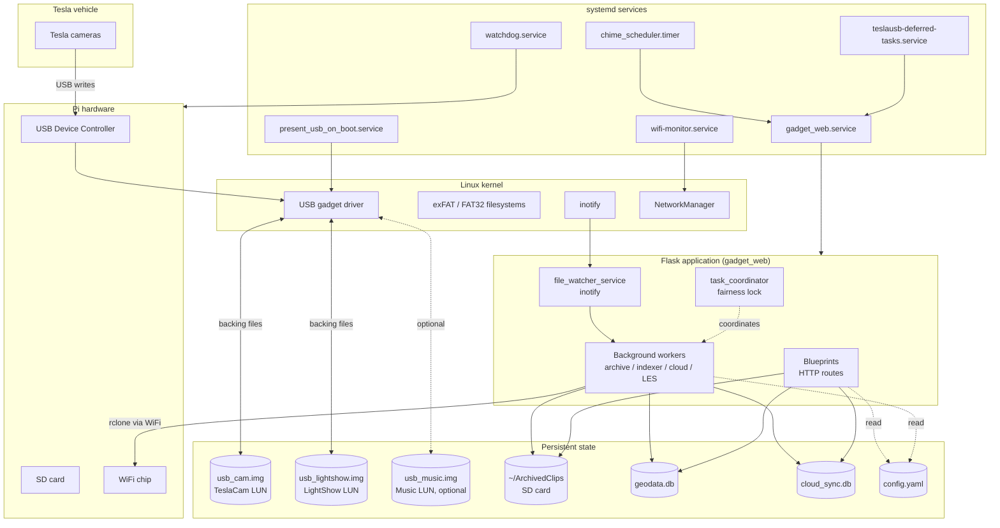
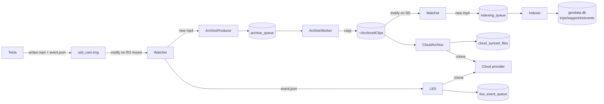

# Architecture

A bird's-eye view of TeslaUSB. After this doc you should be able to
name every major component, sketch the data flow between them, and
know which document to read for the deeper details.

For "what happens to a video?" — that's the
[`VIDEO_LIFECYCLE.md`](VIDEO_LIFECYCLE.md) flagship doc, and you
should read it next.

---

## What TeslaUSB is

A Raspberry Pi (Zero 2 W) that:

1. **Pretends to be a USB drive** that Tesla writes dashcam, Sentry,
   and Saved-event clips to.
2. **Captures those clips** to its own SD card before Tesla rotates
   them out.
3. **Indexes** each clip's H.264 SEI metadata to extract GPS, speed,
   and telemetry.
4. **Maps** the trips on a web UI with event markers.
5. **Uploads** the important clips to a cloud provider (Google Drive,
   S3, etc.) via rclone.
6. **Manages** lock chimes, light shows, custom wraps, license plates,
   and boombox sounds — everything Tesla reads from the LightShow
   and Music drives.
7. **Falls back** to its own WiFi access point when no home network
   is reachable, so the in-car browser can still drive the UI.

All of this runs on a Pi with **512 MB of RAM** and a **single SDIO
bus** shared between the SD card and the WiFi chip. The architecture
is shaped around those two constraints.

---

## Layered view



---

## The major components

### Hardware

- **Raspberry Pi Zero 2 W** (4 ARM cores, 512 MB RAM)
- **USB Device Controller (UDC)** — kernel interface to the gadget
- **SD card** — OS, runtime data, all `.img` files, all SQLite DBs
- **Broadcom WiFi chip** — shares SDIO bus with the SD card

### USB gadget

The Pi presents 2 or 3 LUNs to Tesla:

| LUN | Drive       | Filesystem | Backing file        |
|-----|-------------|------------|---------------------|
| 0   | TeslaCam    | exFAT      | `usb_cam.img`       |
| 1   | LightShow   | FAT32      | `usb_lightshow.img` |
| 2   | Music *(opt)*| FAT32     | `usb_music.img`     |

The gadget binds the `.img` files **directly** — not via loop devices.
Loop devices are used only for **local mount access** so the web UI
can read or write the contents.

The gadget is bound at boot by `present_usb.sh` writing the UDC name
to `/sys/kernel/config/usb_gadget/g1/UDC`. Unbind happens (rarely)
during edit-mode switches and during chime-change USB rebinds. **Any
unbind during normal operation loses Tesla footage**, so background
subsystems are forbidden from triggering one.

### Modes

- **Present mode** (default) — gadget bound, partitions mounted RO,
  Samba off
- **Edit mode** (rare) — gadget unbound, partitions mounted RW,
  Samba on

The UI does not expose mode terminology to the user; write
operations transparently use `quick_edit_part2` to open a brief RW
window on LUN 1 without leaving present mode. See
[`GLOSSARY.md`](GLOSSARY.md) for the full definition.

### systemd services

The Pi-side services that drive everything:

| Service                              | Owns                                                              |
|--------------------------------------|-------------------------------------------------------------------|
| `present_usb_on_boot.service`        | Bind the USB gadget at boot (~3 s after power-on)                  |
| `gadget_web.service`                 | The Flask web app + ALL background workers                         |
| `chime_scheduler.timer` + `.service` | Periodic chime schedule check (every 60 s)                         |
| `wifi-monitor.service`               | STA-loss detection + AP fallback                                   |
| `watchdog.service`                   | Userspace ping for the hardware watchdog (90 s timeout)            |
| `network-optimizations.service`      | Power-save off for WiFi (roaming responsiveness)                   |
| `teslausb-deferred-tasks.service`    | Post-boot cleanup + random chime selection (runs after gadget bind) |
| `teslausb-safe-mode.service`         | Detects 3+ reboots in 10 minutes; skips TeslaUSB services if so    |

Notice that **`gadget_web.service` owns every background worker**.
The archive worker, indexing worker, cloud-archive worker, LES
worker, file watcher, and chime scheduler ticker are all threads
inside the Flask process. There is no separate worker daemon.

### The Flask application (`gadget_web`)

`scripts/web/web_control.py` is the app factory. It:

1. Loads `config.yaml` via `scripts/web/config.py`.
2. Initializes `geodata.db` and `cloud_sync.db` (running migrations
   in `mapping_migrations.py`).
3. Registers every blueprint under `scripts/web/blueprints/`.
4. Starts the background workers as daemon threads.
5. Starts the file watcher.
6. Binds Flask on port **80** (required for captive portal).

The blueprints are organized by page or API surface
(`mapping.py`, `videos.py`, `cloud_archive.py`, `jobs.py`, etc.).
Service modules under `scripts/web/services/` hold the actual
business logic so blueprints stay thin.

---

## The big four background workers

All four run in the `gadget_web` process. All four use the
`task_coordinator` to take a fairness-aware mutex before doing
heavy work.

### 1. File watcher

`file_watcher_service.py`. Single thread using Linux `inotify`
plus a 5-minute polling fallback. Watches the **read-only USB
mount** and the **`~/ArchivedClips` SD-card folder**. Routes
events:

- New `.mp4` on RO mount → archive callback (after 60 s age gate)
- New `.mp4` in ArchivedClips → indexing callback
- New `event.json` (anywhere) → Live Event Sync callback (no age gate)

### 2. Archive worker

`archive_worker.py`. Single thread that drains the
`archive_queue` table (in `cloud_sync.db`):

```
producer enqueues → claim → atomic_copy → mark copied → enqueue indexing
```

Copies clips from the read-only USB mount to `~/ArchivedClips/<date>/`
on the SD card, **before** Tesla rotates RecentClips (~60 minute
buffer). Heavily throttled — `nice` priority, inter-file sleep,
load-pause guard, chunk pause, per-file time budget.

### 3. Indexing worker

`indexing_worker.py`. Single thread that drains the
`indexing_queue` table (in `geodata.db`):

```
producer enqueues → claim → index_single_file → terminal/retry outcome
```

Parses each clip's H.264 SEI for GPS, telemetry, and event
detection. Writes `indexed_files`, `waypoints`, `detected_events`
rows. Updates / merges `trips`. Returns a typed `IndexResult` with
an `IndexOutcome` enum value.

### 4. Cloud upload (two cooperating workers)

- **`cloud_archive_service.py`** — bulk catch-up uploader. Drains
  `cloud_synced_files` (status `pending`). Priority order: events
  first → geolocated → non-event (opt-in). One rclone subprocess
  at a time.
- **`live_event_sync_service.py`** (LES) — opt-in real-time
  uploader. Triggered by `event.json` arrival. Drains
  `live_event_queue`. Has its own thread, idle on
  `threading.Event.wait()`. **Disabled by default.**

The two cloud subsystems coordinate via `task_coordinator`. When
LES has work, `cloud_archive` yields between files. The NM WiFi
dispatcher (`refresh_cloud_token.py`) wakes LES first, waits up
to 10 minutes for it to drain, then triggers `cloud_archive`.

---

## Data flow at a glance



That diagram is the **video lifecycle** in 14 nodes. Every node has
its own dedicated subsystem doc. The full narrative — including
every branch, decision point, retry, and failure mode — is in
[`VIDEO_LIFECYCLE.md`](VIDEO_LIFECYCLE.md).

---

## Persistent state

Three categories of persistent state live on the SD card:

### USB-gadget backing files

- `usb_cam.img` — TeslaCam drive
- `usb_lightshow.img` — LightShow drive
- `usb_music.img` *(if `disk_images.music_enabled`)* — Music drive

These are owned by `installation.target_user`, live in
`installation.mount_dir`, and are **protected** from every UI
delete code path.

### SD-card archive

- `~/ArchivedClips/<YYYY-MM-DD>/<event-folder-or-flat>/` — copies of
  Tesla's recordings, retained per `cleanup.default_retention_days`
  (default inherited; current default 30 days).

### SQLite databases

| File             | Owns                                                                          |
|------------------|-------------------------------------------------------------------------------|
| `geodata.db`     | Trips, waypoints, detected events, indexed file records, the indexing queue   |
| `cloud_sync.db`  | Cloud-upload state, the archive queue, the LES queue, sync sessions           |

Schemas are documented in
[`contributor/core/DATABASES.md`](contributor/core/DATABASES.md).

### One-line state files

- `state.txt` — current mode (`present` or `edit`)
- `~/.quick_edit_part2.lock` — quick-edit in-flight marker (120 s
  stale timeout)
- `/run/teslausb-ap/force.mode` — runtime AP force mode (lost on reboot)

---

## Configuration

A single `config.yaml` at the repo root holds **everything**:
paths, credentials, network settings, archive thresholds, indexing
params, cloud sync behavior, retention, AP behavior, mapping event
detection thresholds.

Two thin wrappers expose values to runtime code:

- **Bash** reads via `scripts/config.sh` (uses `yq`).
- **Python** reads via `scripts/web/config.py` (uses PyYAML).

Both wrappers cache the parsed YAML once at startup. **Never
hardcode values** in source — always read from the wrappers. After
editing `config.yaml`, restart `gadget_web.service` (and
`wifi-monitor.service` if AP/STA settings changed).

For a comprehensive reference of every configuration key,
see [`contributor/core/CONFIGURATION_SYSTEM.md`](contributor/core/CONFIGURATION_SYSTEM.md).

---

## Networking

Two interfaces, both managed by NetworkManager:

- **`wlan0`** — STA mode, connects to a home / mesh / extender SSID
- **`uap0`** — virtual AP interface, broadcasts `offline_ap.ssid`

The two run **concurrently** (not exclusively). When STA loses
the configured network, `wifi-monitor.sh` brings the AP up after
`offline_ap.disconnect_grace` seconds. STA reconnect attempts
continue with **exponential backoff** (2.5 → 5 → 15 → 30 min cap)
so a flapping STA can't take the AP down repeatedly. When STA
reconnects with stable RSSI, the AP tears down.

The web UI uses port **80** so the OS captive-portal detection
fires automatically when a device joins the AP.

---

## Mutual exclusion: the task coordinator

The Pi Zero 2 W's single SDIO bus means heavy concurrent I/O
trashes throughput and can starve the watchdog. The
`task_coordinator` is the single mutex point.

Tasks are named: `'indexer'`, `'archive'`, `'cloud_sync'`,
`'live_event_sync'`, `'retention'`. Workers call
`acquire_task('<name>', wait_seconds=N, yield_to_waiters=True)` to
get exclusive access. The fairness model lets a tight cyclic
worker (the indexer) yield to a less-frequent priority task
(archive) without the priority task starving.

`WATCHDOG_NEAR_MISS_THRESHOLD_SECONDS = 60.0`. Any worker that
holds the lock longer than that logs a WARNING with the message
"NEAR-MISS hardware watchdog threshold". This is a forensic hint
that the system was close to a watchdog-triggered reset.

The full coordinator contract is the subject of a future
`core/TASK_COORDINATOR.md` doc.

---

## Failure modes the architecture is designed against

These shaped the architecture and are worth knowing:

1. **Power loss at any time.** Tesla cuts USB power when the car
   sleeps. All file writes use atomic `temp + fsync + rename`. Boot
   `fsck` (`disk_images.boot_fsck_enabled`) auto-repairs the FATs.
   Stale claims in queues are reset to `pending` on startup.
2. **SDIO bus saturation.** Heavy archive copies + concurrent rclone
   uploads + Tesla writes can starve the kernel `mmc1` driver and
   the userspace watchdog. Mitigations: `_atomic_copy` chunk-pause,
   per-file time budget, load-pause guard, single-rclone constraint,
   watchdog priority drop-in.
3. **Tesla onboard-clock drift.** Tesla can write a clip with a
   wildly wrong filename timestamp when GPS time-sync is lost. The
   indexer reads the MP4 `mvhd` atom (GPS-derived UTC) instead of
   the filename for absolute time.
4. **Tesla cache.** Tesla caches USB file contents and won't notice
   a chime change without a USB re-enumeration. After replacing
   `LockChime.wav`, the gadget is unbound and rebound to force a
   re-scan.
5. **Watchdog reset during heavy load.** The hardware watchdog
   resets the Pi if the userspace daemon stops pinging. The
   `watchdog.service` systemd drop-in (`teslausb-priority.conf`)
   gives the daemon `Nice=-5 IOSchedulingClass=realtime` so it
   keeps its tick under load.
6. **STA reconnect storms.** Repeated rapid STA reconnect attempts
   while the AP is up issue heavy `brcmf_cfg80211_stop_ap` SDIO
   writes that can lock the WiFi chip. Mitigated by exponential
   backoff in `wifi-monitor.sh`.

---

## Where to read next

- [`VIDEO_LIFECYCLE.md`](VIDEO_LIFECYCLE.md) — the flagship
  narrative; follows a single clip end-to-end with every branch
  and decision point. **This is the single most important doc.**
- [`GLOSSARY.md`](GLOSSARY.md) — every term defined.
- [`contributor/REPO_LAYOUT.md`](contributor/REPO_LAYOUT.md) — where
  things live in the source tree.
- [`contributor/core/CONFIGURATION_SYSTEM.md`](contributor/core/CONFIGURATION_SYSTEM.md)
  — how the config system works under the hood.
- [`contributor/core/DATABASES.md`](contributor/core/DATABASES.md) —
  schema overview for `geodata.db` and `cloud_sync.db`.

---

## Source files

The architecture description above maps to the following modules.
When any of these change in a way that affects the high-level
behavior, update this doc.

- `scripts/web/web_control.py` — Flask app factory, worker startup
- `scripts/web/services/file_watcher_service.py` — inotify + polling
- `scripts/web/services/archive_*.py` — archive subsystem
- `scripts/web/services/indexing_*.py`, `mapping_*.py` — indexing
- `scripts/web/services/cloud_archive_service.py` — bulk cloud sync
- `scripts/web/services/live_event_sync_service.py` — LES
- `scripts/web/services/task_coordinator.py` — fairness lock
- `scripts/web/services/partition_*.py`, `mode_service.py` — modes/mounts
- `scripts/web/helpers/refresh_cloud_token.py` — NM dispatcher entry point
- `scripts/present_usb.sh`, `scripts/edit_usb.sh` — gadget bind/unbind
- `scripts/wifi-monitor.sh`, `scripts/ap_control.sh` — STA/AP control
- `templates/*.service`, `templates/*.timer` — systemd units
- `templates/99-teslausb-cloud-refresh` — NM dispatcher
- `config.yaml` — the single source of configuration truth
