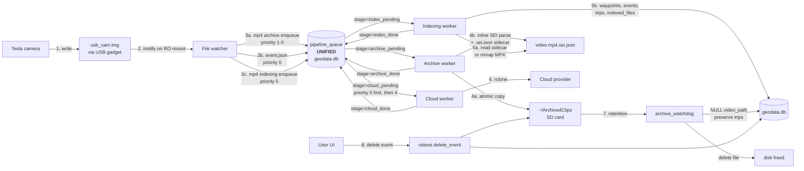
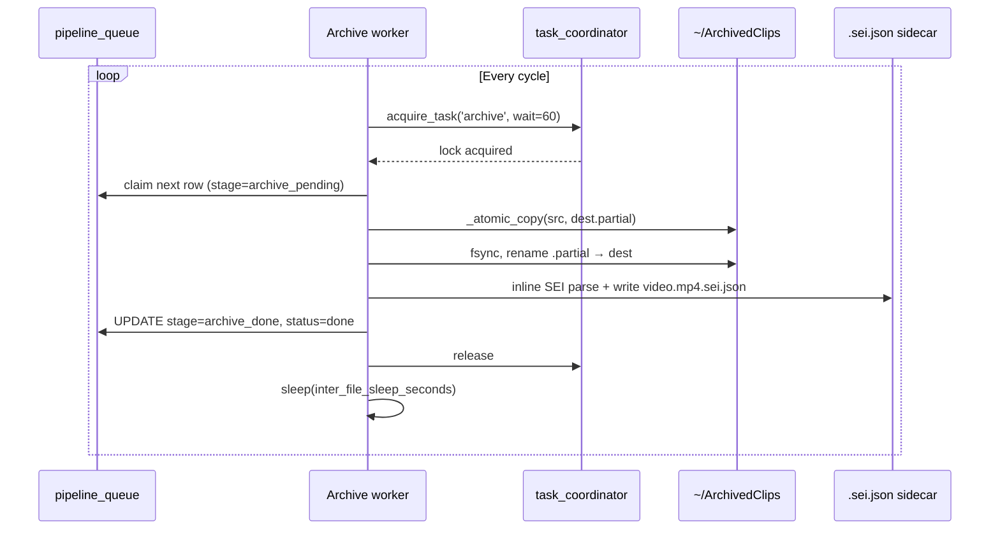
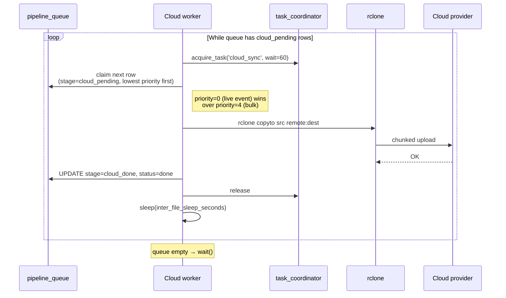
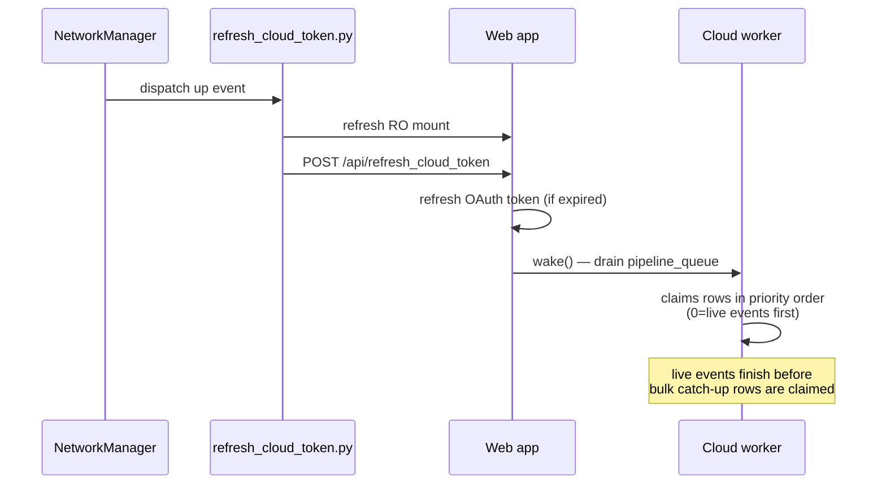
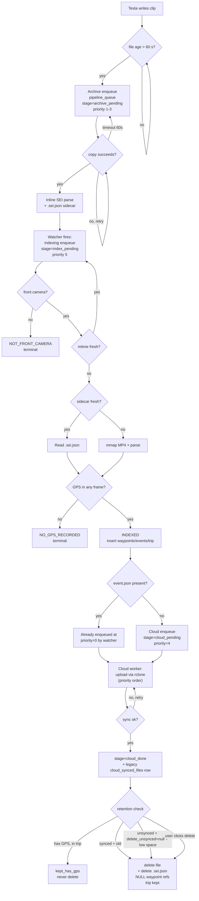

# Video Lifecycle

> The flagship narrative. Follow one Tesla-recorded clip from the
> moment the camera starts capturing it through every decision the
> device makes — archive, index, map, cloud, retention, deletion.
> If you read only one document, read this one.

> **Architecture as of issue #202 (May 2026).** Wave 4 (issue #184)
> consolidated the four legacy queue tables (`archive_queue`,
> `indexing_queue`, `live_event_queue`, `cloud_synced_files`) into
> a **single unified `pipeline_queue`** in `geodata.db`, deleted
> the standalone Live Event Sync (LES) service (PR-F4 / #201), and
> dropped the orphan `live_event_queue` table from `cloud_sync.db`
> (#202). Live-event uploads are no longer a separate subsystem —
> they're first-class `pipeline_queue` rows at
> `priority=PRIORITY_LIVE_EVENT (0)` consumed by the same cloud
> worker that drains bulk catch-up rows. Issue #197 added inline
> SEI parsing during the archive copy with a `.sei.json` sidecar
> so the indexer never re-reads the MP4. Issue #188 rewrote the
> waypoints table for an 8× WAL I/O reduction. Issue #189 cached
> the wal_checkpoint connections.

This doc describes the **complete journey of a single video clip**:

1. **Tesla writes the file** to the USB gadget
2. **The file watcher detects it**
3. **The archive worker copies it** to the SD card (and writes the SEI sidecar)
4. **The indexer parses it** — extracts GPS, telemetry, and detects events
5. **Mapping merges it into a trip** (or doesn't)
6. **The cloud uploader uploads it** — live events first, bulk catch-up after
7. **Retention eventually prunes it**
8. **Or the user deletes it manually**

Every branch the device can take at every stage is enumerated. Each
section ends with a decision-point table you can scan for
"what if?" answers.

For a description of the components themselves (without the
narrative), see [`ARCHITECTURE.md`](ARCHITECTURE.md). For
definitions of recurring terms (LUN, mvhd, pipeline_queue,
quick_edit, …) see [`GLOSSARY.md`](GLOSSARY.md). For the database
schema and table inventory, see
[`contributor/core/DATABASES.md`](contributor/core/DATABASES.md).

---

## At a glance



The top-level data flow is **strictly producer-queue-consumer**
with **one queue and three workers** instead of the four-queues-
four-workers design that preceded Wave 4:

| Worker | Drains stages | Lock key |
|--------|---------------|----------|
| `archive_worker` | `archive_pending` | `'archive'` |
| `indexing_worker` | `index_pending` | `'indexer'` |
| `cloud_worker` (in `cloud_archive_service`) | `cloud_pending` | `'cloud_sync'` |

Producers never bypass the queue; workers never spawn more workers.
Mutual exclusion is enforced through `task_coordinator` so only one
disk- or network-heavy operation runs at a time. This is what keeps
the Pi Zero 2 W from melting under load.

> **Legacy tables still exist.** The Wave 4 migration kept the old
> `archive_queue`, `indexing_queue`, and `cloud_synced_files`
> tables as **read-only history** — they're populated by the
> dual-write hooks for backfill and operator inspection but no
> worker reads from them anymore. The `live_event_queue` table is
> the only one that was actually dropped (cloud_sync.db v3→v4,
> #202) because it was never useful for history (rows were either
> "uploaded" or "failed"). Future cleanup may consolidate the
> remaining legacy tables (#184 phase I.5).

---

## Stage 1 — Tesla writes the file

### What Tesla does

Tesla mounts `usb_cam.img` (LUN 0) as a normal USB mass-storage
device. While driving or in Sentry standby, it writes:

| Folder         | When                                                     | Files per minute     |
|----------------|----------------------------------------------------------|----------------------|
| `RecentClips/` | Continuously, rolling buffer (~60 minutes retained)      | 6 (one per camera)   |
| `SavedClips/<event-dir>/` | User taps the dashcam-save button             | 6 + `event.json`     |
| `SentryClips/<event-dir>/` | Sentry alarm triggers                        | 6 + `event.json`     |

`event.json` is small (< 1 KB) and is **always written last** in
an event folder, atomically — Tesla finalizes the .mp4s first,
then writes event.json as the closing marker. We rely on this
ordering: the file watcher uses `event.json` arrival as the signal
that the event folder is fully populated.

### What's happening underneath

Tesla writes via the **gadget block layer**: byte-level writes go
to the kernel's USB Mass Storage gadget driver (`f_mass_storage`),
which serves them out of the `usb_cam.img` file directly. The
filesystem on the image is exFAT.

The Pi reads the same image file via VFS (the local mount of the
loop device on top of `usb_cam.img`). Tesla and the Pi can
read/write the same image file concurrently — there is no lock
contention between the two paths because they hit the file
through different I/O paths.

### Tesla onboard-clock caveat

Tesla derives the `YYYY-MM-DD_HH-MM-SS-camera.mp4` filename prefix
from the **car's onboard local clock**, not GPS time. When the car
loses GPS time-sync (long underground parking, GPS antenna fault),
the clock drifts. We have observed clips written under the wrong
date by 19+ hours.

The MP4 `mvhd` atom (Movie Header) carries the **GPS-derived UTC
start-of-recording time** and is immune to onboard-clock drift.
The indexer reads `mvhd` first and falls back to the filename
only when the atom is unreadable. **Never write code that uses
the filename for absolute time decisions.**

### Decisions at this stage

| Question                              | Outcome / Rule                                                  |
|---------------------------------------|-----------------------------------------------------------------|
| Can Tesla write while we're reading?  | Yes — gadget block layer and VFS don't contend                  |
| Are filenames trustworthy?            | No — use `mvhd` for absolute time                                |
| Is `event.json` written last?         | Yes — rely on it as the "folder ready" marker                    |
| Is RecentClips persistent?            | No — Tesla overwrites at ~60 min unless we copy it first         |

---

## Stage 2 — The file watcher detects it

`scripts/web/services/file_watcher_service.py` runs a single
thread using Linux inotify, with a 5-minute polling fallback for
filesystems where inotify isn't reliable.

### What's watched

- `/mnt/gadget/part1-ro/TeslaCam/` (recursive) — the read-only
  USB mount
- `~/ArchivedClips/` (recursive) — the SD-card archive folder

### Callback types

The watcher exposes **four** distinct callback subscriptions; each
has its own producer concern. Subscriber wiring lives in
`web_control.py`.

| Callback                              | Fires on                                          | Subscribes to                                                      | Age gate          |
|---------------------------------------|---------------------------------------------------|--------------------------------------------------------------------|-------------------|
| `register_callback(cb)`               | New `.mp4` in `~/ArchivedClips/` only             | Indexer enqueue (`pipeline_queue` at `priority=5`) + cloud-archive wake | **60 s**          |
| `register_event_json_callback(cb)`    | New `event.json` arrivals (any watched root)      | Cloud live-event producer (`pipeline_queue` at `priority=0`)       | None — fires immediately |
| `register_delete_callback(cb)`        | File deletes (rotation, manual)                   | Indexer (orphan cleanup via `purge_deleted_videos`)                | N/A               |
| `register_archive_callback(cb)`       | New `.mp4` on the **RO USB mount** only           | Archive-queue producer (`enqueue_with_peek` → `pipeline_queue` at `priority=1-3`) | 60 s |

The classifier (`_classify_paths` in `file_watcher_service.py`)
routes RO-USB-mount paths exclusively to `_on_archive_callbacks`
and ArchivedClips paths exclusively to `_on_new_file_callbacks` —
they are mutually exclusive by design. This separation is what
lets the archive callback enqueue on first sight (RO USB) while
the indexing callback waits until the file has been copied to the
SD card (ArchivedClips).

### Live-event producer (was: LES service)

Before Wave 4 PR-F4 (#201), `event.json` arrival fed a separate
`live_event_queue` table consumed by the standalone Live Event
Sync worker. That entire subsystem is **gone**. Today the
`event.json` callback calls
`cloud_archive_service.enqueue_live_event_from_event_json(paths)`
which writes a `pipeline_queue` row at
`stage='cloud_pending', priority=PRIORITY_LIVE_EVENT (0)` — the
same queue and the same worker that handle bulk catch-up rows
(at `priority=PRIORITY_CLOUD_BULK (4)`). The unified worker
naturally claims the priority-0 row first; no separate thread,
no separate queue, no opt-in flag.

### The 60-second age gate

The 60-second age gate on `.mp4` files is the **"not still being
written"** check: Tesla finalizes a clip in seconds, but the gate
absorbs jitter and accidental early-trigger calls from inotify.

The **no age gate on event.json** is deliberate — Tesla writes
event.json atomically as the last step of finalizing an event
folder, so by the time inotify reports it the file is complete.
The cloud worker therefore picks up the priority-0 row immediately
(no 60-second delay between Tesla finishing the event and the
cloud upload starting).

### Polling fallback

inotify can miss events when the underlying filesystem is mounted
or remounted (which we do during quick_edit). To recover:

1. **Pure-polling fallback mode** — entered only when `_try_inotify`
   returns `False` at startup. Cadence: `_POLL_INTERVAL_SECONDS = 300`
   (5 minutes).
2. **In-inotify periodic hygiene scan** — runs on the same
   blocking-read cycle as inotify when inotify IS healthy, catching
   files inotify missed and new subdirectories.

Both paths fire callbacks the same way they do from inotify.

### Decisions at this stage

| Condition                                         | Action                                                           |
|---------------------------------------------------|------------------------------------------------------------------|
| New `.mp4` mtime > 60 s old                        | Fire archive callback + (after archive) indexing callback        |
| New `.mp4` mtime ≤ 60 s old                        | Skip; will re-check next poll                                    |
| New `event.json`                                  | Enqueue `pipeline_queue` row at `priority=0` **immediately**     |
| inotify silent for 5 minutes                      | Run polling sweep                                                 |
| Watched mount unmounted (mode switch)             | Watcher pauses; resumes on remount                                |

---

## Stage 3 — The archive worker copies it

`scripts/web/services/archive_worker.py`. Single-thread consumer
of `pipeline_queue` rows where `stage='archive_pending'`. Holds
`task_coordinator('archive')` for the duration of one copy.

> **Queue location: `geodata.db`.** The legacy `archive_queue`
> table still exists for history (populated by the dual-write
> hooks) but the worker reads only `pipeline_queue`. The producer
> writes to both the legacy `archive_queue` AND `pipeline_queue`;
> the unified worker wins.

### Why we copy

Tesla's RecentClips folder rotates at ~60 minutes — once Tesla
overwrites a clip, it's gone forever. Sentry / Saved events live
on the USB drive longer but still take Tesla USB space. By copying
to the SD card we:

1. Preserve clips past Tesla's rotation
2. Free Tesla's USB space (Tesla's own retention removes copied
   clips on its next pass)
3. Give the indexer a stable path to parse from (the RO USB mount
   is volatile during Tesla writes)

**Critical rule**: the indexer **never** parses files directly
from the RO USB mount. Tesla can rotate or rewrite a clip mid-parse,
which causes `FILE_MISSING` errors and broken DB rows. Indexing
runs only against files in `~/ArchivedClips/`.

### Producer side

`archive_producer.py` enqueues files into `pipeline_queue` (and
the legacy `archive_queue` mirror) via `enqueue_with_peek`:

| Trigger                         | When                                                 |
|----------------------------------|-----------------------------------------------------|
| Boot catch-up scan              | Once at gadget_web start (deferred 30 s)             |
| File watcher callback            | Every new `.mp4` on the RO USB mount                |
| Manual trigger                   | UI "Archive Now" button                              |

`enqueue_with_peek` runs the front-cam SEI peek **at the producer**
(not at the worker) for `RecentClips` candidates: if the front-cam
clip carries no GPS-bearing SEI message, the producer drops the
candidate at source. No queue row, no worker pick, no SD writes.
This is the "skip stationary RecentClips at source" pattern from
issue #167. The peek is unconditional; there is no toggle.

### Worker side: the loop



The next stage (indexing) is then enqueued by the file watcher's
`_on_new_videos` callback when inotify reports the destination
file in `~/ArchivedClips/`, NOT by the archive worker directly —
this keeps producer responsibilities cleanly separated.

### Priority ordering

`pipeline_queue_service.PRIORITY_*` constants (lower number = higher):

| Constant                   | Value | Folders matched                           |
|----------------------------|-------|-------------------------------------------|
| `PRIORITY_LIVE_EVENT`      | 0     | `event.json` → cloud upload (not archive) |
| `PRIORITY_ARCHIVE_EVENT`   | 1     | `SentryClips/`, `SavedClips/`             |
| `PRIORITY_ARCHIVE_RECENT`  | 2     | `RecentClips/`                            |
| `PRIORITY_ARCHIVE_OTHER`   | 3     | Anything else (back-fill)                 |
| `PRIORITY_CLOUD_BULK`      | 4     | Bulk cloud catch-up                       |
| `PRIORITY_INDEXING`        | 5     | Default indexing                          |

Events drain before RecentClips because event clips are
irreplaceable (a Sentry trigger is a one-time signal); RecentClips
have continuous coverage so a small prioritization delay is fine.

### Inline SEI parse + sidecar (issue #197)

After every successful copy, the archive worker parses the H.264
SEI NAL units in the just-copied file and writes the per-frame
telemetry to a sibling `.sei.json` sidecar:

```
~/ArchivedClips/RecentClips/2026-05-14_10-30-00-front.mp4
~/ArchivedClips/RecentClips/2026-05-14_10-30-00-front.mp4.sei.json
```

The sidecar carries the GPS-bearing samples Tesla embeds in SEI
messages, sampled at `_INLINE_SEI_SAMPLE_RATE = 30` (one in every
30 frames — about one waypoint per second at 30 fps). The walk
has a soft wall-clock cap so a degenerate file can't stall the
archive worker.

**Why this matters**: pre-#197, the indexer re-opened and re-walked
every MP4 to extract SEI — the same parse the archive worker had
just done implicitly while the file was hot in cache. The sidecar
turns the indexer's MP4 read into a JSON read (~5 KB vs. ~30 MB
per clip), eliminating one full MP4 traversal per indexed file.
The indexer's MP4 mmap path is preserved as the fallback when the
sidecar is missing or stale (mtime/size mismatch), so non-front
cameras and old clips still work.

### `_atomic_copy` guards

The copy itself is **heavily throttled** to keep the SDIO bus
from saturating and starving the watchdog daemon:

| Guard                                | Default | Purpose                                                                  |
|--------------------------------------|---------|--------------------------------------------------------------------------|
| `inter_file_sleep_seconds`           | 1.0 s   | Pause between files                                                      |
| `chunk_pause_seconds`                | 0.25 s  | Pause every chunk **inside** a single copy                                |
| `per_file_time_budget_seconds`       | 60.0 s  | Hard ceiling on a single copy; raises `_CopyTimeBudgetExceeded`          |
| `load_pause_threshold`               | 3.5     | If `loadavg[0] >= 3.5` between files, sleep `load_pause_seconds`         |
| `load_pause_seconds`                 | 30 s    | How long to sleep when load is high                                       |
| `boot_scan_defer_seconds`            | 30 s    | Don't run boot catch-up scan for the first 30 s after gadget_web start    |
| `nice` priority                      | -19 (low) | Process scheduled at lowest CPU priority                                |
| `ionice` class                       | idle    | Block-I/O priority is "idle" — only runs when nothing else needs the disk |

The **mid-copy guards** (`chunk_pause_seconds`, `per_file_time_budget_seconds`)
fire **inside** `_atomic_copy`. If a single copy takes longer than
60 seconds, `_CopyTimeBudgetExceeded` releases the claim back to
`pending` *without* bumping `attempts` — the file is fine, the
system is overloaded, so a row can never reach `dead_letter`
purely from load.

### Status transitions (pipeline_queue.stage)

```
                  ┌────────────────┐
                  │archive_pending │
                  └─────┬──────────┘
                        ▼
                  ┌────────────────┐
                  │archive_pending │ ← worker claim sets
                  │status=in_progress│  status, not stage
                  └─────┬──────────┘
            ┌─────────┬─┴────┬──────────┐
            ▼         ▼      ▼          ▼
     ┌─────────────┐ ┌────┐ ┌──────┐ ┌──────────────┐
     │archive_done │ │err │ │source│ │skipped_      │
     │(triggers    │ │    │ │_gone │ │stationary    │
     │ index_      │ │    │ │      │ │(via producer │
     │ pending)    │ │    │ │      │ │ peek)        │
     └─────────────┘ └─┬──┘ └──────┘ └──────────────┘
                       │
                       ▼
                   ┌─────┐
                   │retry│ → pending (with backoff)
                   └─────┘
                       ↓ attempts >= max
                   ┌──────────┐
                   │dead_letter│ + .dead_letter/<id>.txt sidecar
                   └──────────┘
```

### Decisions at this stage

| Condition                                          | Outcome                                                              |
|----------------------------------------------------|----------------------------------------------------------------------|
| Source file no longer exists when claimed          | `source_gone` (terminal) — Tesla rotated it out before we got to it |
| Front-cam SEI peek shows no GPS movement           | **Producer drops** at `enqueue_with_peek`; no queue row created      |
| Copy completes successfully                        | Stage advances to `archive_done`; sidecar written; row remains for indexing-stage advance |
| Copy raises `_CopyTimeBudgetExceeded` (≥60 s)      | Release claim back to `pending`, don't increment `attempts`           |
| Copy raises any other exception                    | `error` → retry with backoff                                          |
| `attempts >= retry_max_attempts`                   | `dead_letter` + sidecar `.txt` at `~/ArchivedClips/.dead_letter/`     |
| `loadavg[0] >= 3.5` between files                  | Sleep 30 s, then retry from queue                                     |

> **Wave 1 (#185) consolidation note.** The pre-Wave-1 design had
> an `archive.skip_stationary_recent_clips` config flag (default
> `false`) that gated the SEI peek. That toggle was removed in
> Wave 1 — the peek now runs on every RecentClips candidate
> unconditionally because there is no reason a parked-no-event
> RecentClips clip should ever consume SD space. Sentry and
> SavedClips are always copied (the peek is bypassed for
> `priority=PRIORITY_ARCHIVE_EVENT`).

---

## Stage 4 — The indexer parses it

`scripts/web/services/indexing_worker.py`. Single-thread consumer
of `pipeline_queue` rows where `stage='index_pending'`. Holds
`task_coordinator('indexer')`.

> **Queue location: `geodata.db`.** Same table as the archive
> worker, different stage. The indexer never reads from the
> legacy `indexing_queue` table.

### What "indexing" means

For each archived `.mp4`:

1. Read the **`.sei.json` sidecar** if present and fresh (matching
   mtime/size). If missing or stale, mmap the MP4 and parse the
   H.264 SEI NAL units to extract Tesla's per-frame telemetry
   payload (GPS, speed, accelerations, gear, autopilot state,
   blinkers, brake, steering).
2. Read the `mvhd` atom for the absolute UTC start time.
3. Insert one `waypoints` row per parsed frame.
4. Run event detection over the waypoint sequence.
5. Insert any triggered events into `detected_events`.
6. Update or merge a `trips` row.
7. Insert a booking row in `indexed_files`.

### Sidecar fast path (issue #197)

The sidecar produced by the archive worker is ~5 KB of compact
JSON containing the GPS-bearing SEI samples. When present and
fresh:

- Indexer skips the mmap + SEI walk entirely (~30 MB of file I/O
  saved per clip)
- The mvhd-derived absolute start time is also cached in the
  sidecar so the second `mvhd` read is also skipped
- The indexer falls back to MP4 mmap parsing if the sidecar is
  missing (rotated-in old clip, dead_letter file, etc.) or if the
  sidecar's recorded mtime/size doesn't match the current file
  (file replaced after sidecar wrote)

This is the dominant memory + I/O optimization on the Pi Zero 2 W.
The sidecar is invalidated automatically by `purge_deleted_videos`
when retention deletes the MP4.

### `index_single_file` returns a typed `IndexResult`

The result carries an `IndexOutcome` enum value plus details:

| `IndexOutcome`            | What it means                                                  | Next action                                           |
|---------------------------|----------------------------------------------------------------|-------------------------------------------------------|
| `INDEXED`                 | Successfully parsed and stored                                 | Stage advances to `index_done` (terminal for indexer) |
| `ALREADY_INDEXED`         | `indexed_files` already has a matching row                     | Stage advances to `index_done`                        |
| `DUPLICATE_UPGRADED`      | New file is a higher-quality dup of an existing row            | Replace existing, advance to `index_done`             |
| `NO_GPS_RECORDED`         | Frames had no GPS telemetry (parking-lot recording)            | Insert `indexed_files`, no waypoints, advance         |
| `NOT_FRONT_CAMERA`        | File is `*-back.mp4` / `*-left_repeater.mp4` etc.              | Skip (only the front cam carries the canonical SEI)   |
| `TOO_NEW`                 | mtime within `mapping.index_too_new_seconds` (default 120 s)   | Defer with backoff                                    |
| `FILE_MISSING`            | File deleted between enqueue and parse                         | Mark done; let purge_deleted_videos sweep references  |
| `PARSE_ERROR`             | SEI/mvhd parse raised                                          | Retry with backoff                                    |
| `DB_BUSY`                 | SQLite returned BUSY                                           | Retry with backoff                                    |

The retry set is **`{TOO_NEW, PARSE_ERROR, DB_BUSY}`**. All other
outcomes are terminal — the queue row's stage advances to
`index_done`. After enough retries, the row moves to
`status='dead_letter'` (visible on `/jobs`).

### Front camera only

Tesla writes 6 cameras per minute (`-front`, `-back`,
`-left_repeater`, `-right_repeater`, `-left_pillar`,
`-right_pillar`). Only the **front camera** carries the canonical
SEI telemetry — the other five mirror it but it's redundant. We
parse only `*-front.mp4`. The other five rows still get archived
(for playback) but they enter `pipeline_queue` only as
`stage='archive_pending'` and are skipped at the index stage with
`NOT_FRONT_CAMERA`.

### Trip merge

After waypoints are inserted, the indexer decides whether they
belong to an existing trip:

```
Take the new clip's first waypoint.
Find the most recent existing waypoint with timestamp before this one.
If gap_seconds < trip_gap_minutes (default 5 min):
    merge into the existing trip
    extend its end_time / end_lat / end_lon
Else:
    create a new trip row
```

**The gap math uses `strftime('%s', x)` for exact integer-second
arithmetic**, never `(julianday(a) - julianday(b)) * 86400` —
the latter has float precision issues that misclassify boundary
gaps. (See PR #78 for the bug history.)

### Event detection

`mapping_service.detect_events()` scans the waypoints and may
insert rows for:

- `harsh_brake`, `emergency_brake` — based on negative
  acceleration thresholds
- `hard_acceleration` — positive acceleration threshold
- `sharp_turn` — steering-angle + speed combination
- `speeding` — over a configured limit
- `fsd_engage`, `fsd_disengage` — autopilot state transitions

All thresholds live under `mapping.event_detection` in
`config.yaml`.

### Hot/cold waypoints split (issue #184 Wave 3 / v15)

Wave 3 split the `waypoints` table into a hot table (frequently-
queried columns: `id`, `trip_id`, `timestamp`, `lat`, `lon`,
`speed`, `video_path`) and a `waypoints_cold` table (large /
rarely-read columns: per-frame autopilot state, blinker history,
detailed accelerations). Map and trip queries hit only the hot
table; the cold table is loaded only when the user opens a
detailed event view. The v14→v15 migration was a **single-table
rewrite** that achieved an 8× WAL I/O reduction on subsequent
INSERTs (see `mapping_migrations.py`).

### Decisions at this stage

| Condition                                              | `IndexOutcome`             |
|--------------------------------------------------------|----------------------------|
| Filename is not `*-front.mp4`                           | `NOT_FRONT_CAMERA`         |
| File mtime within last 120 s                            | `TOO_NEW`                  |
| `indexed_files` has matching row already                 | `ALREADY_INDEXED`          |
| New file is a larger / longer dup of existing            | `DUPLICATE_UPGRADED`       |
| No GPS in any parsed frame                               | `NO_GPS_RECORDED`          |
| Parse raises                                             | `PARSE_ERROR`              |
| SQLite BUSY                                              | `DB_BUSY`                  |
| File missing at parse start                              | `FILE_MISSING`             |
| Everything succeeded                                     | `INDEXED`                  |
| New waypoints' first ts within 5 min of an existing trip | Merge into that trip       |
| Otherwise                                                | Create new trip            |
| Sidecar present, mtime+size match                        | Skip MP4 mmap; read JSON   |
| Sidecar missing or stale                                 | Fall back to MP4 mmap      |

---

## Stage 5 — Cloud upload

**One worker, one queue.** Wave 4 PR-F4 (#201) collapsed the two-
worker design (separate `live_event_sync_service` + bulk
`cloud_archive_service`) into a single cloud worker that drains
`pipeline_queue` rows where `stage='cloud_pending'`. Live-event
priority is achieved by `priority` ordering, not by a separate
service.

### The unified cloud worker

`scripts/web/services/cloud_archive_service.py` runs one
long-lived daemon thread that idles on `threading.Event.wait()`
(~0.1% CPU) when the queue is empty. It wakes on:

- File watcher's `_on_new_videos_for_cloud` callback (a new MP4
  appeared in `~/ArchivedClips/`)
- File watcher's `_on_new_event_json` callback (a new event.json
  enqueued a `priority=0` row)
- NM dispatcher's `/api/refresh_cloud_token` POST after WiFi
  reconnects
- Mode-switch hook (returning to present mode)
- Manual UI buttons ("Sync to Cloud", "Retry Failed")

Each cycle:



### Why this is simpler than the old design

Pre-Wave-4, there were **two cloud workers**:

1. `cloud_archive_service` — bulk catch-up worker, drained the
   `cloud_synced_files` table
2. `live_event_sync_service` (LES) — real-time event uploader,
   drained `live_event_queue`, had its own retry policy, daily
   data cap, webhook, opt-in flag, and inter-file yield contract
   to ensure cloud_archive yielded when LES had work

The yield contract was a maintenance burden — every change to
the cloud worker had to verify "still yielding to LES correctly?"
Today the same priority signal ("live events first") falls out of
SQL: `SELECT … ORDER BY priority ASC, enqueued_at ASC` returns
the priority-0 row first. The worker doesn't need to know
anything about live events vs. bulk; it just claims the next row.

### Live-event producer

When `event.json` arrives, the file watcher calls
`cloud_archive_service.enqueue_live_event_from_event_json(paths)`.
This:

1. Parses the event.json to extract `event_dir`, `timestamp`,
   `reason`.
2. Resolves the upload scope from
   `cloud_archive.live_event_upload_scope` (default `event_minute`
   — event.json + the 6 cameras matching the
   `YYYY-MM-DD_HH-MM` prefix).
3. Inserts one `pipeline_queue` row per file at
   `stage='cloud_pending', priority=PRIORITY_LIVE_EVENT (0)`.
4. Wakes the cloud worker via `Event.set()`.

No separate thread, no separate queue, no separate retry policy.
Live-event rows go through the same retry/backoff machinery as
bulk rows.

### Cloud sync coverage rules

`cloud_archive.sync_non_event_videos: false` (default) means the
producer enqueues only:

- Sentry / Saved event clips (the 6 cameras in event dirs)
- Geolocated clips (RecentClips that the indexer found GPS in)

Non-event, non-GPS clips never enter the cloud queue.
`sync_non_event_videos: true` enqueues everything.

### NM dispatcher arbitration on WiFi reconnect

When WiFi reconnects, the NM dispatcher
(`refresh_cloud_token.py`) does this in order:



The pre-Wave-4 design had multiple barriers (wait for LES drain
before triggering archive; wait for archive before triggering
cloud) — these are gone. The single worker handles ordering itself
via priority.

### Power-loss safety

A row is marked `stage=cloud_done, status=done` only **after**
rclone confirms upload AND the DB commit completes AND fsync
returns. If power dies mid-upload:

- The row is still `status='in_progress'` with a non-NULL
  `claimed_at` and `claimed_by`.
- On startup, `recover_stale_claims_pipeline()` resets every
  row whose `claimed_at` is older than the stale threshold back
  to `status='pending'`.
- The next sync cycle re-uploads. rclone's chunked uploads are
  resumable for providers that support it.

The `claimed_by` / `claimed_at` columns were added in v17 (Wave 4
PR-D / #193) precisely to make this recovery deterministic.

### Decisions at this stage

| Condition                                                | Outcome                                                  |
|----------------------------------------------------------|----------------------------------------------------------|
| New event.json arrives                                    | Enqueue `priority=0` row(s); wake worker; uploaded next  |
| Bulk catch-up row at `priority=4` is claimed AND a `priority=0` row arrives mid-upload | The priority-0 row is uploaded **next** (after current row finishes) — the worker doesn't preempt mid-rclone, but the SQL ordering ensures it picks priority-0 next |
| WiFi down                                                 | Worker idles; queue grows                                 |
| WiFi reconnects                                           | NM dispatcher wakes worker; live events drain first      |
| `cloud_archive.sync_non_event_videos: false` + non-event  | Producer skips — only events + geolocated clips uploaded |
| Upload fails 5 times                                      | Row → `status='dead_letter'`, requires manual retry      |
| Worker crashes mid-upload                                 | `claimed_at` ages out; `recover_stale_claims_pipeline` resets to pending on startup |

---

## Stage 6 — Retention prune

The clip is now on the SD card, indexed, possibly cloud-uploaded.
Sooner or later retention will reclaim its disk space.

### `archive_watchdog` — the periodic guard

Runs from `gadget_web`. Two distinct prune operations:

1. **`_run_retention_prune`** — scheduled daily (with 5–15 min
   jitter to stagger fleets). Walks the **entire** ArchivedClips
   tree and deletes .mp4 files older than the resolved retention
   horizon. Per-file decisions:

   - mtime newer than cutoff → keep
   - cloud configured AND `delete_unsynced` resolves to `False`
     AND not yet recorded as `synced` in `cloud_synced_files` →
     keep, count as `kept_unsynced_count`
   - else → delete via `_delete_one_mp4` (calls
     `safe_delete_archive_video` → `purge_deleted_videos`)

2. **`reclaim_stationary`** — disk-pressure / "Reclaim
   stationary" triggered. Walks **only**
   `~/ArchivedClips/RecentClips/` and deletes parked-no-event
   stationary clips, sorted into these per-file buckets:

   | Bucket                          | Criterion                                                                  | Action |
   |---------------------------------|----------------------------------------------------------------------------|--------|
   | `kept_too_new`                  | `mtime > now - min_age_hours` (default 1 h)                                  | Keep    |
   | `kept_has_event_counterpart`    | Stationary clip whose basename also exists under SentryClips/SavedClips     | Keep — preserve user-meaningful copy |
   | `kept_unindexed`                | Indexer hasn't seen it yet (no `indexed_files` row)                         | Keep — wait for indexing |
   | `kept_has_gps`                  | `waypoint_count > 0` — driving footage                                       | Keep    |
   | `kept_has_event_only`           | `waypoint_count = 0 AND event_count > 0` — Sentry trigger while parked       | Keep    |
   | (none of the above)             | Stationary parked-no-event RecentClips clip                                  | Delete  |

> **Note: `cloud_synced_files` is still the source of truth for
> the "is this synced?" check.** Even though the cloud worker now
> writes to `pipeline_queue` first, the dual-write hooks keep the
> legacy `cloud_synced_files` table populated so the retention
> prune can keep using its existing query. Future cleanup
> (#184 phase I.5) may consolidate these.

### The "delete_unsynced" three-state config

`cloud_archive.delete_unsynced` is **tri-state** (`null` / `false` / `true`):

| Value     | Behavior                                                                  |
|-----------|---------------------------------------------------------------------------|
| `null`    | Auto: derived from whether a cloud provider is configured. Cloud configured → behaves like `false` (protect un-uploaded clips). No cloud configured → behaves like `true` (age-only deletion is the only option). |
| `false`   | "Keep until backed up". Unsynced clips past retention are kept and counted in `kept_unsynced_count`; can lead to disk-full if WiFi outage is long enough. |
| `true`    | Age-only deletion. Past-retention clips are eligible regardless of cloud status. |

The default in `config.yaml:160` is `null` (auto). Resolved fresh
on every prune via `_resolve_delete_unsynced()` — config-yaml edits
take effect on the next pass without restarting the service.

> **Auto-resolution.** `_resolve_delete_unsynced` branches purely
> on `_is_cloud_configured()` (provider non-empty AND credentials
> file present), not on free-space. Free-space pressure is handled
> by `reclaim_stationary`'s independent disk-pressure trigger.

### Sacred trips rule

When retention deletes a clip, `mapping_service.purge_deleted_videos()`
is called. This function:

1. Removes the matching `indexed_files` row.
2. **Sets `waypoints.video_path = NULL`** for every waypoint that
   referenced the deleted file.
3. **Sets `detected_events.video_path = NULL`** for every event
   that referenced it.
4. **Deletes the `.sei.json` sidecar** if present (issue #197).
5. **Does NOT touch the `trips` row**. The trip happened — losing
   the dashcam clip doesn't unhappen the drive.

This rule was hardened after the May 7 2026 regression where a
naive cleanup cascade-deleted an entire McDonald's trip's data
when the source clip rotated out. The contract now is:

> **Trips are sacred. Only an explicit user "Delete Trip" action
> may remove them.**

This is enforced in code (`purge_deleted_videos` doesn't take a
trip-deletion path) and in the design system (no UI button
deletes trips silently — only a deliberate user action).

### Watchdog actionability

Retention can also raise a banner in the UI when free space gets
critical. The banner has two flags:

- `severity` — `info` / `warning` / `error` / `critical`
- `actionable` — `true` only when there's something the user can
  *do* (worker stalled with pending work, or disk critically full)

The UI shows the "footage may be lost" banner only when both
`severity ∈ {error, critical}` AND `actionable === true`. The
distinction matters because non-actionable critical states (e.g.,
"the cleanup is in progress and disk is briefly low") shouldn't
spam users with banners they can't dismiss with action.

### Decisions at this stage

| Condition                                                | Bucket / Action                                                |
|----------------------------------------------------------|----------------------------------------------------------------|
| Has GPS waypoints (any clip, any folder)                 | `kept_has_gps` — never deleted by `reclaim_stationary`         |
| Detected event but no GPS (Sentry parked trigger)        | `kept_has_event_only` — kept by `reclaim_stationary`           |
| RecentClips clip with same basename in SentryClips/SavedClips | `kept_has_event_counterpart` — kept                       |
| Stationary parked-no-event RecentClips clip              | `reclaim_stationary` deletes (counted in `deleted_count`)      |
| File mtime older than retention cutoff, synced to cloud  | `_run_retention_prune` deletes                                  |
| File mtime older than retention cutoff, unsynced, `delete_unsynced=false` (or `null` with cloud configured) | Keep, increment `kept_unsynced_count` |
| File mtime older than retention cutoff, unsynced, `delete_unsynced=true` (or `null` without cloud) | `_run_retention_prune` deletes |
| Free space critical + worker idle                        | `actionable=true` → banner shown                                |
| Free space critical + worker actively pruning            | `actionable=false` → banner suppressed                          |

---

## Stage 7 — User deletion

Users can also delete clips manually from the UI. Two entry
points:

### Delete a single event

`scripts/web/blueprints/videos.py::delete_event(folder, event_name)`.

- Returns 403 if not in Edit Mode (`current_mode() != "edit"`).
- Sanitizes both URL params with `os.path.basename()` to strip
  any `/` or `..` components.
- For `RecentClips` / `ArchivedClips` (flat structure): deletes
  every camera view matching the session timestamp via the
  single-doorway helper
  `services.file_safety.safe_delete_archive_video` (which
  enforces the IMG-protection guard and removes the `.sei.json`
  sidecar alongside the MP4).
- For `SavedClips` / `SentryClips` (event structure): deletes
  the entire event folder.
- Returns JSON success/failure with `deleted_count`, `error_count`,
  and `deleted_files`.

The `purge_deleted_videos` reconciliation runs naturally when
the file-watcher delete callback observes the missing files
(or on the next daily stale-scan), not synchronously inside
`delete_event`.

### "Delete a trip" — no dedicated user-facing route

The codebase intentionally lacks a per-trip delete endpoint. The
only places that `DELETE FROM trips`:

1. `mapping_service.py` — internal trip-merge logic (when two
   adjacent trips merge, the absorbed one's row is removed).
   Not user-initiated.
2. `blueprints/mapping.py` — the `/api/index/rebuild` handler,
   which wipes `waypoints`, `detected_events`, `trips`, and
   `indexed_files` together before re-running the boot catch-up.
   This is the index-rebuild button, not a per-trip delete.
3. `mapping_migrations.py` — schema-migration cleanup.
4. `clock_skew_repair.py` — manual repair tool for clock-glitch
   incidents (see GLOSSARY for the May 2026 onboard-clock-drift
   incident).

`purge_deleted_videos` (called by both `videos.delete_event`
indirectly and by the watchdog retention prune) does **not**
delete trips — it only NULLs `waypoints.video_path` /
`detected_events.video_path` and removes the `indexed_files` row.
The "trips are sacred" rule is enforced by the absence of a
per-trip delete path. If a per-trip delete UI is ever added it
would be the **only** non-rebuild route that can `DELETE FROM
trips` and would need its own audit.

### Decisions at this stage

| Condition                          | Outcome                                                 |
|------------------------------------|---------------------------------------------------------|
| User clicks "Delete event" (in Edit Mode) | Files removed via `safe_delete_archive_video`; trip kept; DB references NULLed by next watcher / stale-scan pass |
| User clicks "Delete event" (in Present Mode) | 403 — must switch to Edit Mode (Network File Sharing) first |
| Filename `folder` or `event_name` contains `..` or `/` | `os.path.basename()` sanitizes it before any FS access |
| Folder is `ArchivedClips` but archive is disabled | 404 |
| `event_name` resolves to a non-existent folder/file | 404 |
| File is `*.img` or otherwise protected | `DeleteOutcome.PROTECTED` — counted as error, not deleted |
| User wants to delete a trip itself     | No code path. Trips are sacred. The only way to remove a trip row outside of merge / rebuild is `/api/index/rebuild`, which wipes everything. |

---

## Tying it together: the full clip-lifetime decision tree



---

## Cross-cutting safety rules

These apply at every stage. Violating any of them has caused
real production incidents (cited in the relevant
copilot-instructions sections).

1. **Background subsystems never unmount or rebind the USB
   gadget.** Tesla may be recording at any moment. Any UDC
   unbind / LUN clear / RO→RW remount of part1 loses footage.
   The only USB-disrupting operations are user-initiated
   (`quick_edit_part2`, mode switch, gadget rebind after lock
   chime change). Background workers (archive, indexer, file
   watcher, cloud_archive, LES) are read-only consumers.
2. **Tesla writes via the gadget block layer; we read via VFS.**
   No lock contention. Concurrent reads/writes of the same image
   file are fine.
3. **VFS cache invalidation on the RO mount uses
   `echo 2 > /proc/sys/vm/drop_caches` (slabs only).** Never
   `umount -l + remount` — that breaks the gadget's view.
4. **mvhd over filename for absolute time.** Always.
5. **Trips are sacred.** Only an explicit user delete may remove
   a `trips` row. `purge_deleted_videos` only NULLs `video_path`
   and removes the `.sei.json` sidecar.
6. **Index from `~/ArchivedClips/` only.** Never from the RO USB
   mount. Tesla may rotate a clip mid-parse.
7. **One worker per stage, one rclone subprocess at a time.**
   Coordinated via `task_coordinator` keys `'archive'`,
   `'indexer'`, and `'cloud_sync'`. The pre-Wave-4 `'live_event_sync'`
   key is gone (LES service was deleted; live events are
   `priority=0` rows in `pipeline_queue`).
8. **No new heavy dependencies in `cloud_archive_service.py`.** It
   owns the unified cloud worker on the Pi Zero 2 W. Use
   `urllib.request` for webhooks; never `requests`. Never
   `cv2`/`av`/`PIL`/`numpy` — the SEI sidecar is the indexer's
   job, not the cloud worker's.
9. **Atomic copy + fsync + rename for every file write.** Power
   cuts at any time. The same rule applies to the SEI sidecar
   (`sei_parser.write_sei_sidecar` writes to `*.sei.json.tmp`
   then renames).
10. **All workers go through `pipeline_queue`.** Never read
    directly from `archive_queue` / `indexing_queue` /
    `cloud_synced_files` again — those tables are dual-written
    for history but no worker drives off them. Adding a new
    "I'll just query the legacy table" code path re-creates the
    coordination problem the unification fixed.

---

## Where to read next

- [`ARCHITECTURE.md`](ARCHITECTURE.md) — the component-level view
  of everything described above.
- [`GLOSSARY.md`](GLOSSARY.md) — every term defined.
- [`contributor/core/DATABASES.md`](contributor/core/DATABASES.md)
  — the database tables this doc references.
- [`contributor/core/CONFIGURATION_SYSTEM.md`](contributor/core/CONFIGURATION_SYSTEM.md)
  — every config key cited above.
- *(planned)* `contributor/subsystems/VIDEO_ARCHIVE.md`,
  `VIDEO_INDEXING.md`, `MAPPING_AND_TRIPS.md`, `EVENT_DETECTION.md`,
  `TELEMETRY_AND_SEI.md`, `FILE_WATCHER.md`.
- *(planned)* `contributor/subsystems/CLOUD_ARCHIVE.md` —
  the home of all cloud-upload concerns (live events included
  now that LES has been folded in).
- *(planned)*
  `contributor/flows/POWER_LOSS_RECOVERY.md`,
  `MODE_SWITCH_PRESENT_TO_EDIT.md`,
  `MODE_SWITCH_EDIT_TO_PRESENT.md`.

---

## Source files

The lifecycle described above touches these modules. When any of
them changes in a way that affects the per-stage decisions, update
this doc.

- `scripts/web/services/file_watcher_service.py` — Stage 2 (one
  inotify watcher, three callback families)
- `scripts/web/services/archive_producer.py` — Stage 3 producer
  (front-cam SEI peek for RecentClips)
- `scripts/web/services/archive_worker.py` — Stage 3 worker
  (drains `pipeline_queue.stage='archive_pending'`; writes inline
  SEI sidecar after every successful copy)
- `scripts/web/services/archive_queue.py` — legacy status enum +
  priority constants; **dual-write only** post-Wave-4, no worker
  reads from it anymore
- `scripts/web/services/archive_watchdog.py` — Stage 6 retention
- `scripts/web/services/indexing_worker.py` — Stage 4 worker
  (drains `pipeline_queue.stage='index_pending'`; reads
  `.sei.json` sidecar fast-path)
- `scripts/web/services/indexing_queue_service.py` — legacy
  indexing queue; **dual-write only** post-Wave-4
- `scripts/web/services/pipeline_queue_service.py` — **the unified
  queue** (Wave 4). All `STAGE_*` / `PRIORITY_*` constants,
  `claim_next_for_stage`, `peek_top_n_paths_for_stage`,
  `recover_stale_claims_pipeline`, `pipeline_status`. The single
  source of truth for what every worker picks up next.
- `scripts/web/services/mapping_service.py` — Stage 4
  (`index_single_file`, `IndexResult`, `IndexOutcome`,
  trip merge, `purge_deleted_videos`)
- `scripts/web/services/mapping_queries.py` — read-only map queries
- `scripts/web/services/mapping_migrations.py` — `_SCHEMA_VERSION`
  (currently 17), v15 hot/cold split, v16 pipeline_queue
  introduction, v17 claim-persistence columns
- `scripts/web/services/sei_parser.py` — owns the SEI sidecar
  API: `SIDECAR_SUFFIX = '.sei.json'`, `write_sei_sidecar`,
  `read_sei_sidecar`, `delete_sei_sidecar` (issue #197)
- `scripts/web/services/cloud_archive_service.py` — Stage 5
  unified cloud worker. Owns `enqueue_live_event_from_event_json`
  (the producer that replaced LES), the `_migrate_drop_live_event_queue_v4`
  cleanup, and the cloud_sync.db schema.
- `scripts/web/services/task_coordinator.py` — fairness lock
  contract (keys: `'archive'`, `'indexer'`, `'cloud_sync'`)
- `scripts/web/helpers/refresh_cloud_token.py` — NM dispatcher;
  on WiFi up, refreshes RO mount + OAuth token, then wakes the
  unified cloud worker (no LES barrier — priority ordering in
  `pipeline_queue` handles it)
- `scripts/web/blueprints/videos.py::delete_event()` — Stage 7
- `scripts/web/services/file_safety.py` —
  `safe_delete_archive_video` single-doorway delete (also
  invalidates the `.sei.json` sidecar)

