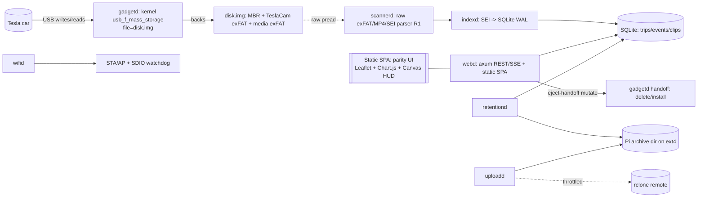

# SPEC — TeslaUSB (B-1 reset: kernel-backed LUN + full-Rust rebuild)

> Status: Draft for build. Source of truth for the reset architecture.
> Derived from `docs/plan.md` (4-model synthesis) and operator decisions D1/D2.
> Component specs live alongside this file in `docs/specs/`.

This is the overarching system specification. It defines the objective, the
single non-negotiable invariant, the chosen architecture, the component map, and
the cross-cutting standards (commands, project structure, code style, testing,
boundaries). Each service has its own spec file; this document is the index and
the contract they all share.

---

## 1. Objective & target users

**Objective.** Turn a Raspberry Pi Zero 2 W into the most *reliable possible*
USB dashcam drive for a Tesla, plus a local web app to manage the recorded media
and the car's USB media features — **without ever causing the car to stop
recording**. We are resetting the B-1 architecture: removing the userspace
"pretend drive" middleware (teslafat over NBD) and the entire Python/Flask web
app, and rebuilding on a kernel-backed mass-storage gadget with a full-Rust
service layer. We preserve the *look, feel, and feature set* of today's web app.

**Why reset.** B-1's userspace daemon sits in the car's write path. When it (or
the Pi) dies — wifi-watchdog reboot, OOM on 512 MB, crash, hang — the car gets a
hard I/O error, latches the USB port off, and only a vehicle power-cycle
recovers it. The kernel-backed approach makes a Pi crash/reboot look like a
*clean unplug*, which the car tolerates. This is how the reliable V1 worked.

**Target users.**
- **Primary:** the device owner — a Tesla driver who wants a set-and-forget
  dashcam drive plus a friendly local web UI to review trips/events, play clips
  with a telemetry HUD, and manage chimes/lightshows/music/boombox/plates/wraps.
- **Secondary:** the operator/maintainer (often the same person) doing in-place
  upgrades and diagnostics over SSH on the live device.
- **Tertiary:** contributors building/testing the Rust services and SPA.

**Fixed constraints.**
- Hardware is **Pi Zero 2 W (512 MB RAM, single USB OTG, BCM43436 WiFi)** — fixed.
- **No OS reinstall, no SD reflash.** Convert the existing device in place
  (decision D2).
- **Full Rust app layer. Python/Flask removed entirely** (decision D1).
- The backing "drive" is a **kernel-served disk-image file** (S1), not a
  repartition of the live boot card.

---

## 2. THE #1 INVARIANT (everything serves this)

> **The car must ALWAYS be able to write TeslaCam when powered on.**

If the drive disappears mid-write or returns I/O errors, the car latches the USB
port off and ONLY a vehicle VBUS power-cycle recovers it. No Pi-side software
recovers a latched port. Therefore:

1. The car-facing LUN is a **kernel-owned block device** (`usb_f_mass_storage`,
   configfs/libcomposite) backed by an **image file** (`file=disk.img`). **Zero
   userspace in the write path.** A Pi crash/OOM/reboot looks like a clean
   unplug, never EIO.
2. The Pi **never** mounts the Tesla filesystem read-write while the car owns it.
3. Pi-side writes go through an **eject-handoff** (soft-eject → mount RW locally →
   mutate → fsync → re-present), never during an active Sentry/honk save.
4. `gadgetd` is the **only** critical service. Everything else is disposable and
   memory-capped, and **nothing else may ever trigger a reboot or gadget restart
   on the car's behalf**.

Any change that adds risk to the write path is rejected by default. When a spec
and this invariant conflict, the invariant wins.

---

## 3. Architecture (decided): S1 + A + O1

Chosen optimum from the options table in `docs/plan.md`, updated per operator
decisions: **S1 (image-file LUN) + A (full-Rust app) + O1 (existing Pi OS,
cleaned in place + hardened).**

- **Storage / gadget (S1):** kernel `usb_f_mass_storage`, `file=<disk.img>` on
  the existing ext4 data area. Inside the image: **MBR + 2 partitions**
  (TeslaCam exFAT + media exFAT) — the car reads chimes/lightshows/boombox/music
  only from a partition of the same physical device it records to
  (hardware-proven).
- **Reads (R1):** a conservative Rust **raw exFAT/MP4/SEI parser** that
  `pread()`s the image/loop and never mounts; trusts only files whose dir entry +
  cluster chain + MP4 tail are stable across scans. Optional short-lived
  **raw-parser-over-snapshot** for explicit playback/export — never an unbounded
  snapshot, **never dm-thin under the live LUN** (rejected: pool-full → EIO →
  latch).
- **Writes:** Rust **eject-handoff mutator**, car-state-aware, never during saves.
- **App layer (A — full Rust):** small cooperating binaries (§4). UI rebuilt as a
  small **static SPA** that achieves **visual parity** with today.
- **OS (O1, in place):** keep the existing Raspberry Pi OS on the existing SD;
  clean out all old B-1 software + leftover/temp/junk; then harden: read-only
  root + overlay, hardware watchdog armed, cgroup `MemoryMax` caps, gadgetd
  `OOMScoreAdjust=-1000`.



---

## 4. Component map (one spec file each)

| Service | Criticality | Responsibility | Spec |
|---------|-------------|----------------|------|
| `gadgetd` | **CRITICAL** (the invariant guardian) | Configure/maintain the kernel mass-storage LUN; own the disk image + partition layout; perform the eject-handoff for Pi-side writes | [`gadgetd.md`](./gadgetd.md) |
| `scannerd` | disposable | R1 raw exFAT/MP4/SEI parser; emit stable-clip + SEI records; never mount | [`scannerd.md`](./scannerd.md) |
| `indexd` | disposable | Consume parser output; derive trips/events/clips into SQLite (WAL) | [`indexd.md`](./indexd.md) |
| `webd` | disposable | axum REST + SSE API; serve the static SPA; drive eject-handoff mutations | [`webd.md`](./webd.md) |
| SPA | static assets | Parity UI: media hub, trip map, event player + telemetry HUD, media managers, cloud, storage, settings | [`spa.md`](./spa.md) |
| `uploadd` | disposable | Durable, resumable, throttled, prioritized cloud upload from the Pi-side archive directory | [`uploadd.md`](./uploadd.md) |
| `retentiond` | disposable | Retention + archive rules so the car buffer never loses wanted clips and the disk never fills | [`retentiond.md`](./retentiond.md) |
| `wifid` | disposable | STA/AP state machine; TX rate cap; SDIO chip-reset watchdog | [`wifid.md`](./wifid.md) |
| Migration | ops | In-place M1–M5 + hardening; reversible, rails-safe | [`migration.md`](./migration.md) |

The external Tesla USB interface every component must respect is captured
separately (not a service): [`tesla-usb-contract.md`](./tesla-usb-contract.md) —
partitions, required folders, case sensitivity, camera-file naming, media
features, and the `RecentClips` rotation reality.

The **SD-card space-management** design (the continuous space governor, reserve
tiers, value-scoring eviction, single-deleter authority, crash-safe deletion) is
specified in [`storage.md`](./storage.md) and implemented inside `retentiond`.

The **development methodology** — spike/PoC on real hardware before any long
buildout, with an ordered, risk-gated de-risking backlog and a fail-fast agile
loop — is [`hardware-first-development.md`](./hardware-first-development.md). It
governs the order in which §9's unknowns are proven and turned into buildout.

**Reuse vs. new.** KEEP the existing Rust SEI/indexing parser knowledge and the
hard-won feature behavior (event thresholds, retention rules, cloud layout,
every screen's look/feel). REMOVE teslafat/NBD and the Flask app entirely. NEW:
`gadgetd`, the raw reader, the eject-handoff, and the Rust web/API server + SPA.

---

## 5. Commands (cross-cutting)

The Rust workspace lives under `rust/`. Component specs may add service-specific
commands; these are the shared ones.

```bash
# Build (host)
cargo build --workspace
cargo build --workspace --release

# Cross-compile for the target (Pi Zero 2 W)
cargo build --workspace --release --target aarch64-unknown-linux-gnu

# Test / lint / format / supply-chain
cargo test --workspace
cargo clippy --workspace --all-targets -- -D warnings
cargo fmt --all --check
cargo deny check            # licenses + advisories (rust/deny.toml)

# SPA (static frontend)
npm ci
npm run build               # emits hashed static bundle served by webd
npm run test                # component/unit tests
npx playwright test         # E2E + perf + console assertions (see §7 and .github/copilot-instructions.md)
```

Deployment to the live device is **only** via the hardware-test skill (dead-man
reboot timer, SSH/WiFi/boot protected, backups before mutate). Never deploy by
hand-editing the device. See [`migration.md`](./migration.md).

---

## 6. Project structure (target)

```
rust/
  Cargo.toml                 # workspace
  crates/
    teslausb-core/           # shared types, config, SQLite access, SEI model (KEEP/extend)
    teslafat/                # legacy synthesizer — REMOVED from runtime; kept only until cutover
    gadgetd/                 # CRITICAL: kernel LUN + eject-handoff
    scannerd/                # R1 raw exFAT/MP4/SEI reader
    indexd/                  # trips/events/clips derivation -> SQLite
    webd/                    # axum API + static SPA host
    uploadd/                 # cloud upload queue
    retentiond/              # retention + archive
    wifid/                   # STA/AP + SDIO watchdog
spa/                         # static SPA source (Preact/Svelte/Solid + Leaflet + Chart.js)
  src/, public/, dist/
deploy/                      # systemd units, configfs templates, hardening configs
docs/
  plan.md                    # architecture synthesis (background)
  specs/                     # THIS spec set
```

Each service is a **small, single-purpose binary**. Shared logic goes in
`teslausb-core`. No service except `gadgetd` may touch the car-facing write path.

### 6.1 On-device storage layout (no-reflash reality)

Because the design is **no-reflash / no-repartition** (O1), there is **no new
physical partition** for our data. Everything Pi-side lives on the **existing
Linux ext4 data filesystem** (the SD card's data area, rooted at `/srv/teslausb`
today). The car-facing drive is a single **image file** on that same filesystem;
the archive and index are **directories on the Linux side, outside the image**.

```
/srv/teslausb/
  disk.img                 # the car-facing LUN (fixed/preallocated size).
                           #   Internally: MBR + p1 TeslaCam(exFAT) + p2 media(exFAT).
                           #   The ONLY thing the car can see.
  archive/                 # Pi-side ARCHIVE — NOT inside disk.img, car cannot see it
    SavedClips/<ts>/...    #   mirrors Tesla naming (tesla-usb-contract.md §4)
    SentryClips/<ts>/...
    RecentClips/<ts>-<cam>.mp4
  media/                   # staging for p2 media features (chimes/boombox/lightshow/music)
/var/lib/teslausb/
  index.sqlite3            # SQLite (WAL) catalog of trips/events/clips + archive
/run/teslausb/*.sock       # local IPC sockets
```

Key consequences:
- **Archived videos are stored in `…/archive/` on the Linux ext4 filesystem**,
  separate from `disk.img`. `webd` serves playback from there; `indexd` catalogs
  it; `uploadd` uploads from there. The car never sees the archive.
- `disk.img` is **fixed-size**, so a growing archive cannot corrupt the LUN — but
  it shares free space with the host ext4, so `retentiond`'s quota MUST keep the
  ext4 healthily free (so SQLite/WAL and operations never run out of space).
- **`disk.img` sizing is a provisioning decision (flag, not yet fixed).** On a
  finite card the budget must close: `card_total ≥ disk.img (fully fallocated)
  + OS/root + archive budget + all reserves` ([`storage.md` §2](./storage.md)).
  `disk.img` splits into **p1 (dashcam, large)** + **p2 (media, small —
  chimes/boombox/lightshow/music are MB-scale)**. Bigger `disk.img` = more car
  buffer but less Pi archive room; the split and absolute size are chosen at
  provisioning per card capacity and **measured on hardware** (§9), not hard-coded
  here. M3 ([`migration.md`](./migration.md)) must confirm enough free space
  exists post-cleanup before creating it.
- A future reflash (S2) could promote `archive/` and the index to their own
  physical partition; until then "Pi-side archive **directory**" is the precise
  term — not "archive partition".

**Keeping the card from filling is a safety function.** Because `disk.img` is
fixed/preallocated, the car's incoming video never grows ext4 — **our** archive +
index + WAL + staging + logs are the unbounded consumers. A continuous **space
governor** ([`storage.md`](./storage.md)) watches free space/inodes, holds an
OS/`gadgetd`/SQLite reserve **sacrosanct**, and evicts the **least-valuable** safe
archived item first (never undurable Saved/Sentry, never pinned/leased). A starved `gadgetd` is the
**principal** path by which low space could endanger car writes; a secondary,
slower path is that if Pi ext4 is exhausted, archiving (and the car-side cleanup
handoffs it drives) stalls, so the **car's** own exFAT volume can fill over time
([`retentiond` §3](./retentiond.md)). The governor's job is to bound **our**
footprint so neither path is reached.


---

## 7. Code style & engineering standards

These specs are self-contained: the standards below bind every component. If a
future code-quality document is added, it supplements (does not replace) these.

- **Rust:** 2021+ edition; `cargo fmt` clean; `clippy -D warnings`; no `unwrap()`/
  `expect()` in service paths (return `Result`, handle errors); `unsafe` only
  where the kernel/FFI boundary requires it, with a safety comment and a test.
- **Memory discipline (512 MB Pi):** bounded buffers, streaming I/O, no loading
  whole videos into RAM. Every non-critical service runs under a cgroup
  `MemoryMax`. `gadgetd` gets `OOMScoreAdjust=-1000`. **OOM kill order**
  (most-disposable first → never):
  `uploadd → wifid → webd → scannerd → retentiond → indexd → NEVER gadgetd`.
  Rationale: `uploadd` (pure convenience) sheds first; `wifid`/`webd`/`scannerd`
  are stateless/restartable and the car is unaffected when they pause;
  `retentiond` and `indexd` are the **protected pair** just below `gadgetd`
  because together they run safe eviction — `retentiond` hosts the space governor
  and `indexd` is the sole SQLite writer the governor (and UI) depend on, so
  killing either stops the card from being freed. There is **no** `thumbnailer`
  service: keyframe thumbnails are a capped, best-effort task inside `scannerd`
  ([`scannerd` §3](./scannerd.md)), killed with it.
- **No transcoding on the Pi, ever.** SEI is parsed once at index time; the HUD
  is rendered **client-side** (Canvas/WebGL over native `<video>`). Tesla
  TeslaCam footage is **H.264/AVC** (observed on HW3/HW4, Main/High profile —
  this is what v1's `sei_parser.py` and `teslausb-core/src/sei` already parse in
  production); telemetry lives in an **H.264 SEI `user_data_unregistered`**
  (`payload_type=5`) NAL as a protobuf. Keep the parser and the player
  **codec-aware** (detect from `avcC`/`hvcC`) so a future HEVC variant can be
  added, but do **not** assume H.265 — H.264 plays natively in all target
  browsers, so a "download to view" path is an edge-case guard, not the norm.
- **Security / trust model.** Today's web UI has **no app-level login** (verified:
  the Flask app uses cloud **OAuth** only, no `login_required`); the device runs
  on a **trusted home LAN**, and AP-onboarding mode must use **WPA2** (never an
  open AP). Preserve that model — do **not** silently add or drop auth — but treat
  it explicitly: `webd` mutations (clip delete, media install) are powerful, and
  cloud **OAuth refresh tokens** + WiFi/Samba credentials are secrets that must be
  stored with restrictive permissions (root-only, `0600`), never world-readable,
  never logged, never in the SPA bundle or the Tesla volume. See [`webd` §security](./webd.md).
- **SQLite (WAL)** lives on the **Pi-side ext4 data filesystem** (outside the
  car's `disk.img` LUN). It is rebuildable side state; it is **never** placed on
  the Tesla volume.
- **SPA:** small framework (Preact/Svelte/Solid), vendored map/chart libs to keep
  parity (**Leaflet + MarkerCluster**, **Chart.js**, the existing `dashcam-mp4`
  SEI HUD approach). No heavy SPA frameworks; ship a small hashed static bundle.
  MapLibre is a **rejected** alternative (would change look/feel; parity wins).
- **Comments** only where they add clarity. No dead code, no speculative
  abstractions.

---

## 8. Testing strategy (cross-cutting)

- **Unit/integration (Rust):** `cargo test` per crate. The raw parser, the
  stability gating, the eject-handoff state machine, and the SEI decoder MUST
  have property/fixture tests with recorded byte-level fixtures.
- **Invariant tests:** `gadgetd` must have tests proving that a service
  crash/restart/handoff presents as a clean unplug, never an error to the LUN
  consumer. Handoff must refuse to mutate during a simulated active save.
- **UI (mandatory Playwright, per `.github/copilot-instructions.md`):** every
  UI-affecting change is verified end-to-end in a real browser — assert on
  navigation TTFB, DOMContentLoaded, FCP, the slowest 5–10 network requests,
  **zero** console/pageerror, a screenshot at 375px and ≥1280px, and proof the
  changed JS module is actually loaded by the served page. "Tests pass" /
  "endpoint 200" is **not** sufficient.
- **Hardware acceptance:** the highest-risk unknowns (§9) are prototyped on the
  live device first, via the hardware-test skill, before anything depends on them.
  The spike methodology (time-boxed PoC loop, ordered/gated risk backlog,
  fail-fast outcomes, fold-back-into-specs) is
  [`hardware-first-development.md`](./hardware-first-development.md).
- **Second-opinion gate:** for root-causing issues and before any risky
  live-hardware step, run a parallel GPT-5.5 second opinion and reconcile (per
  `.github/copilot-instructions.md`).

---

## 9. Prototype-first unknowns (gate everything else)

These must be proven on hardware before downstream work depends on them. **The
*process* for spiking these — the time-boxed spike loop, the ordered/gated spike
backlog of risk-named spikes, PASS/FAIL/INCONCLUSIVE outcomes, and the agile feedback cycle
— is specified in [`hardware-first-development.md`](./hardware-first-development.md).**
That doc is binding: do not start a long buildout on any unknown below until its
gating spike PASSes with captured parameters.

1. Tesla acceptance of **one image-file LUN with MBR + 2 partitions** (chimes/
   lightshow read from p2). Prove first.
2. **Clean eject + rebind** behavior — soft-eject treated as benign (no latch);
   re-insert resumes recording in ~2 s; measure mid-write disappearance tolerance.
3. **Raw exFAT parsing + clip-stability detection while the car writes** — no
   false "stable".
4. **BCM43436 TX throttle threshold** — Mbps/chunk size that avoids the SDIO
   deadlock; `rmmod/modprobe brcmfmac` recovery reliability.
5. **microSD latency under car-write + Pi index/copy** — Pi I/O must never starve
   car writes (ionice/IOWeight; A2/V30 media).
6. **Cold boot-to-gadget-ready** time (target < 8–10 s).
7. **H.264 SEI HUD sync + browser playback** across desktop + mobile. Confirm the
   telemetry-bearing **H.264 SEI** (`user_data_unregistered`, `payload_type=5`)
   is present and matches `teslausb-core/src/sei` across the **target build/HW
   range** (incl. any HW4/Cybertruck clips, which could ship a different codec or
   SEI layout); a "download to view" fallback only where a browser can't decode a
   clip's codec.
8. **`disk.img` sizing + space-budget closure on the real card** — pick the
   absolute size and p1/p2 split, fully `fallocate` it, and verify
   `card_total ≥ disk.img + OS + archive budget + reserves` holds with healthy
   headroom (§6.1, [`storage.md` §2](./storage.md)).

---

## 10. Boundaries

**ALWAYS**
- Treat the #1 invariant as supreme; protect the car's write path above all else.
- Keep `gadgetd` the only critical service; cap memory on everything else.
- Do Pi-side writes via the eject-handoff; never mount the Tesla FS RW while the
  car owns it; never mutate during an active save.
- Parse SEI once at index time; render the HUD client-side; never transcode.
- Keep SQLite/derived state on the Pi-side ext4 filesystem (outside the car's
  `disk.img` LUN); treat it as rebuildable.
- Deploy/migrate only via the hardware-test skill, reversibly, with backups
  first and SSH/WiFi/boot protected.
- Verify UI changes with Playwright (perf + console + screenshot + wiring).
- Preserve the existing look, feel, and feature set.

**ASK FIRST**
- Any change that touches or could add latency/failure to the car's write path.
- Reflashing / repartitioning the live boot card (S2) — off the table unless the
  operator explicitly chooses to reflash.
- Dropping or materially redesigning an existing user-facing feature/screen.
- Introducing a new heavyweight dependency, language, or toolchain.
- Any irreversible live-device operation.

**NEVER**
- Put the sacred LUN on dm-thin / CoW, or take an unbounded block snapshot under
  the live LUN.
- Let any non-`gadgetd` service reboot the Pi or restart the gadget on the car's
  behalf.
- Mount the Tesla filesystem read-write concurrently with the car.
- Transcode video on the Pi, or load whole clips into RAM.
- Reintroduce Python/Flask into the runtime, or NBD/teslafat into the write path.
- Store derived/SQLite state on the Tesla volume.
- Commit secrets; bypass these specs' standards; declare UI work done without
  Playwright
  verification.
