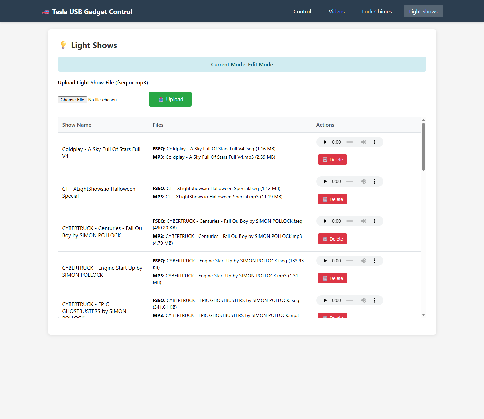

# TeslaUSB

Transform your Raspberry Pi into a smart USB drive for Tesla dashcam recordings with remote access, web-based file management, and automated maintenance.

> **🚨 IMPORTANT - CHANGES FOR EXISTING USERS 🚨**
>
> Significant changes have been made to the application. All configuration is now centralized in a single `config.yaml` file. Please read the [Configuration](#configuration) section for details on updating your setup.  You may want to restart from a clean Raspberry PI OS image and follow the [Installation](#installation) steps again to ensure everything is set up correctly. If you do not want to do that, ensure that the config.yaml file is created and updated with your desired settings and then run the `setup_usb.sh` script again to apply the new configuration structure.
>
> **The web interface now runs on PORT 80 (standard HTTP) instead of port 5000.**
>
> - **Old URL**: `http://<pi-ip>:5000` ❌
> - **New URL**: `http://<pi-ip>` ✅ (no port needed!)
>
> This change enables the **captive portal feature** - when you connect to the TeslaUSB WiFi network, your device will automatically open the web interface without typing any URL.

## Overview

TeslaUSB creates a multi-drive USB gadget that appears as **two or three separate USB drives** to your Tesla:

- **TeslaCam Drive**: Large exFAT drive for dashcam and sentry recordings
- **LightShow Drive**: Smaller FAT32 drive for lock chimes, custom wrap images, and light shows with read-only optimization
- **Music Drive** *(optional)*: FAT32 drive for Tesla music playback (enabled via `music_enabled: true` in config)

**Key Benefits:**
- Remote access to dashcam footage without physically removing storage
- Web interface for browsing videos, managing chimes, managing light shows, managing custom wrap images, managing music, and monitoring storage (with light/dark mode)
- Automatic cleanup policies to manage disk space
- Scheduled chime changes for holidays, events, or automatic rotation
- Offline access point for in-car web access when WiFi is unavailable

> **⚠️ Personal Project Notice**
>
> This is a personal project built for my own use. You are welcome to fork the code and make your own changes or updates. Please be aware:
> - The Git repository may update frequently with new features and changes
> - Bugs may be introduced into the main branch without extensive testing
> - Bug fixes will be worked on as time permits, but **no timelines or guarantees** are provided
> - You have access to the source code - if something breaks, you can attempt to fix it yourself
> - This project is provided as-is with no warranty or support obligations

## Features

### Core Functionality
- **Multi-Drive USB Gadget**: Two or three independent filesystems (TeslaCam + LightShow + optional Music) with optimized performance
- **Two Operating Modes**:
  - **Present Mode**: Active USB gadget for Tesla recording
  - **Edit Mode**: Network access via Samba shares for file management
- **Web Interface**: Browser-based control panel accessible at `http://<pi-ip>` (port 80)
- **Captive Portal**: Automatic splash screen when connecting to TeslaUSB WiFi network

### Video Management
- Browse all TeslaCam folders (RecentClips, SavedClips, SentryClips)
- Auto-generated video thumbnails
- In-browser multi-camera event player with 6 camera angles
- **HUD Overlay Toggle**: Switch between two playback modes:
  - **Stream Mode** (default): Instant video playback with minimal bandwidth - perfect for quick video review
  - **Overlay Mode**: Downloads full video to display real-time telemetry overlay with speed, gear selection (P/R/N/D), steering wheel angle, accelerator/brake pedal position, turn signals, and Autopilot status
  - Toggle preference is remembered across sessions
  - Bandwidth optimization: Partial downloads are cached and resumed when switching modes
- Download all camera views for an event as a zip file
- Delete entire events (Edit mode only)
- Storage analytics with folder-by-folder breakdown

### Lock Chime Management
- Upload WAV or MP3 files (automatically converted to Tesla-compatible format)
- Organized chime library with preview and download
- Volume normalization presets (Broadcast, Streaming, Loud, Maximum)
- **Chime Groups**: Organize chimes by theme (Holidays, Funny, Seasonal, etc.)
- **Random Selection on Boot**: Automatically pick a different chime from your selected group each time the device boots
- Scheduled chime changes:
  - Weekly schedules (specific days/times)
  - Date-based schedules
  - Holiday schedules (Christmas, Easter, Thanksgiving, etc.)
  - Recurring rotation (every 15min to 12 hours, or on boot)

### Light Show Management
- Upload FSEQ and MP3/WAV files
- Grouped display (pairs sequence + audio files)
- Preview MP3/WAV tracks in browser
- Delete complete light show sets

### Custom Wrap Management
- Upload PNG files for Tesla's Paint Shop 3D vehicle visualization
- Thumbnail previews of all uploaded wraps
- Automatic validation (512-1024px dimensions, max 1MB, PNG only)
- Supports up to 10 custom wraps at a time
- Drag-and-drop upload with progress indicator

### Automatic Maintenance
- **Storage Cleanup**: Age, size, or count-based policies per folder
- **Boot Cleanup**: Optional automatic cleanup before presenting to Tesla
- **On-Demand Thumbnails**: Instant generation via PyAV as you browse (cached for 7 days)
- **Chime Scheduler**: Checks every 60 seconds for scheduled changes
- **Hardware Watchdog**: Automatic system recovery on hangs or crashes

### Network Features
- **Samba Shares**: Windows/Mac/Linux file access in Edit mode
- **Offline Access Point**: Automatic fallback AP when WiFi unavailable (in-car web access)
- **WiFi Roaming**: Automatic switching between access points with the same SSID for optimal signal strength (mesh networks and WiFi extenders)

## Requirements

> **Note**: This project has only been tested on **Raspberry Pi Zero 2 W**. Other OTG-capable models should work but are untested.

- **Tesla Software**: Version **2025.44.25.1 or later** (2025 Holiday Update) required for event thumbnails, SEI telemetry data, and multi-camera event structure
- **Raspberry Pi Zero 2 W** (tested and recommended) - Small form factor, low power, powered directly from Tesla USB port
- Other Raspberry Pi models with USB OTG capability should work (Pi 4, Pi 5, Compute Modules) - **untested**
- 128GB+ microSD card (for OS, dashcam storage, light shows, and music)
- Raspberry Pi OS (64-bit) Desktop - Debian "Trixie"
- Internet connection for initial setup

### Raspberry Pi OTG Compatibility

For USB gadget projects like TeslaUSB, the **Raspberry Pi Zero family and Compute Modules are the best choice**. Raspberry Pi 4 and 5 offer OTG support, but their higher power requirements can be an issue. **Raspberry Pi A, B, 2B, 3B, and 3B+ do NOT support OTG** (host mode only).

For detailed information, see the official Raspberry Pi whitepaper: [Using OTG mode on Raspberry Pi SBCs](https://pip.raspberrypi.com/categories/685-app-notes-guides-whitepapers/documents/RP-009276-WP/Using-OTG-mode-on-Raspberry-Pi-SBCs.pdf)

| Model | OTG Support | Notes |
|-------|-------------|-------|
| Raspberry Pi Zero / Zero W / Zero 2 W | ✅ Yes | Fully supported on USB data port |
| Raspberry Pi 4 | ⚠️ Yes* | USB-C port in device mode |
| Raspberry Pi 5 | ⚠️ Yes* | USB-C port in device mode |
| Raspberry Pi A/B/2B/3B/3B+ | ❌ No | Only host mode - **not compatible** |
| Raspberry Pi Compute Module 1-3 | ✅ Yes | Exposed on OTG pins |
| Raspberry Pi Compute Module 4 | ✅ Yes | micro-USB on CM4 IO board |

*\* Raspberry Pi 4 and 5 draw power from the host via USB cable, so there may be limitations on available current due to their higher power requirements.*

**Note for Pi Zero 2 W users**: Setup automatically optimizes memory by disabling unnecessary desktop services and enabling 1GB swap. This ensures stable operation on the 512MB RAM platform.

**⚠️ Note for Raspberry Pi 4/5 users**: USB OTG/gadget mode is **only available on the USB-C port**, which is also the power input. This creates a challenge: you cannot simultaneously power the Pi from a standard USB charger and present as a USB device to Tesla. Options include:
- USB-C power + data splitter adapters (search "USB-C OTG with PD charging")
- Powering the Pi via GPIO pins from a separate car charger (advanced)
- Using a larger SD card instead of external USB storage to avoid power budget issues

## Installation

### 1. Prepare Raspberry Pi

1. Flash **Raspberry Pi OS (64-bit) Desktop** using [Raspberry Pi Imager](https://www.raspberrypi.com/software/)
2. Configure OS customization settings:
   - Set hostname (e.g., `cybertruckusb`)
   - Enable SSH with password authentication
   - Set username/password (default: `pi`)
   - Configure WiFi credentials
   - Set timezone and keyboard layout
3. Insert microSD into Pi and boot (wait 2-3 minutes)
4. Verify SSH access: `ssh pi@cybertruckusb.local`

### 2. Install TeslaUSB

```bash
git clone https://github.com/mphacker/TeslaUSB.git
cd TeslaUSB
chmod +x setup_usb.sh
sudo ./setup_usb.sh
```

The setup script will:
- Install required packages (parted, dosfstools, python3-flask, python3-av, samba, hostapd, dnsmasq, ffmpeg)
- Optimize memory for low-RAM systems (disable desktop services, enable swap)
- Configure USB gadget kernel modules and hardware watchdog
- Detect and disable conflicting `rpi-usb-gadget` service (Pi OS Trixie default)
- Create disk images (TeslaCam + LightShow + optional Music) with interactive image dashboard
- Set up Samba shares and web interface with on-demand thumbnail generation
- Configure systemd services with auto-restart on failure
- Create `/Chimes` library and migrate existing lock chimes

### 3. Access Web Interface

Open `http://<pi-ip-address>` or `http://<hostname>.local` in your browser (port 80 - no port number needed).

Alternatively, connect to the TeslaUSB WiFi network and the captive portal will automatically open.

### 4. Connect to Tesla

Connect the Pi to your Tesla's USB port:
- **Pi Zero 2 W**: Use USB port labeled "USB" (not "PWR")
- **Pi 4/5**: Use USB-C port

Tesla will detect the USB drives automatically (two drives, or three if Music is enabled).

### Power & Sleep Behavior

The TeslaUSB device only runs when the car is awake. When your Tesla enters sleep mode, USB ports are powered off and the Raspberry Pi shuts down.

**To keep your vehicle awake for extended management sessions:**
1. Turn on climate control
2. Enable "Dog Mode" or "Camp Mode" from the climate screen
3. Connect to the TeslaUSB web interface and manage your lock chimes, light shows, or videos
4. When finished, disable Dog/Camp Mode and turn off climate control
5. The vehicle will return to sleep, powering off the USB ports

**Note:** For quick operations like viewing videos or changing a lock chime, the car typically stays awake long enough without needing Dog Mode. Use Dog/Camp Mode only for longer management sessions.

## Usage

### Operating Modes

**Present USB Mode** (default on boot):
- Pi appears as USB drives to Tesla
- Drives mounted read-only locally at `/mnt/gadget/part1-ro`, `/mnt/gadget/part2-ro`, `/mnt/gadget/part3-ro` (if Music enabled)
- Web interface: View/play only (no editing) — some operations (chime changes, music uploads) use temporary quick-edit for seamless access
- Samba shares disabled

**Edit USB Mode**:
- USB gadget disconnected
- Drives mounted read-write at `/mnt/gadget/part1`, `/mnt/gadget/part2`, `/mnt/gadget/part3` (if Music enabled)
- Web interface: Full file management (upload, delete, organize)
- Samba shares active for network access

**Switch modes** via web interface or command line:
```bash
sudo ~/TeslaUSB/present_usb.sh  # Activate Present mode
sudo ~/TeslaUSB/edit_usb.sh     # Activate Edit mode
```

### Network Access

**Samba Shares** (Edit mode only):
- `\\<pi-ip-address>\gadget_part1` - TeslaCam drive
- `\\<pi-ip-address>\gadget_part2` - LightShow drive
- `\\<pi-ip-address>\gadget_part3` - Music drive (when `music_enabled: true`)
- Default credentials: username = `pi`, password = `tesla`

**Offline Access Point with Captive Portal**:
When WiFi is unavailable, the Pi automatically creates a fallback access point:
- SSID: `TeslaUSB` (configurable in `config.yaml`)
- Password: `teslausb1234` (change this!)
- IP: `192.168.4.1`
- **Captive Portal**: Automatically opens web interface when you connect (no URL needed!)
- Manual access: `http://192.168.4.1` or `http://teslausb` (port 80)
- Control from web UI: Force start/stop AP or leave in auto mode
  - **Start AP Now**: Forces AP on until reboot or manually stopped
  - **Stop AP**: Returns to auto mode (AP only starts if WiFi fails)
- Change credentials in `config.yaml` before first use
- **Note**: After clicking "Start AP Now" or "Stop AP" buttons, the status may not update immediately. Wait 10-20 seconds and refresh the page to see the current state.

### Web Features

**Settings Tab**:
- Switch between Present USB and Edit USB modes
- Configure offline access point (SSID, password, auto/manual mode)
- View network status and Samba share information

**Videos Tab**:
- Browse all TeslaCam folders with auto-generated thumbnails
- Multi-camera event player with 6 camera angles
- Download all camera views as zip file
- Delete entire events (Edit mode only) - deletes all camera views for the session

**Music Tab** *(requires `music_enabled: true` and Music disk image)*:
- Tesla scans music only from a root-level `Music` folder; the app enforces this and automatically creates it if missing
- Browse folders with breadcrumb navigation and clean per-folder views
- In-browser audio playback for each file (MP3, FLAC, WAV, AAC, M4A supported)
- Drag-and-drop or select files and whole folders; chunked uploads keep memory low and preserve subfolder structure
- Per-file progress and status indicators with size limit validation (configurable max upload size, default 2 GB)
- Create folders, move files, and delete files or entire folders
- Works in both Present mode (via temporary quick-edit) and Edit mode (full access)
- Usage gauge shows used/free space for the music partition

**Lock Chimes Tab**:
- Upload WAV/MP3 files (auto-converted to Tesla format)
- Preview all chimes with in-browser audio player
- Set any chime as active `LockChime.wav`
- Built-in audio editor with waveform visualization:
  - Trim audio with visual waveform display
  - Volume normalization presets (Broadcast, Streaming, Loud, Maximum)
  - Real-time duration and file size preview
  - Save as new file or replace existing
- Schedule automatic chime changes (weekly, date, holiday, recurring)

**Light Shows Tab**:
- Upload and manage FSEQ + MP3/WAV light show files
- Grouped display for matching files
- Preview MP3/WAV audio in browser
- Delete complete light show sets

**Wraps Tab**:
- Upload PNG files for custom Tesla vehicle wraps (Paint Shop → Wraps)
- Thumbnail preview gallery of all uploaded wraps
- Client-side validation before upload (dimensions, file size, format)
- Download or delete existing wraps
- Requirements: PNG format, 512x512 to 1024x1024 pixels, max 1MB, up to 10 wraps

**Analytics Tab**:
- Drive usage gauge and folder breakdown (including Music drive when enabled)
- Filesystem health checks: Quick Check (read-only, any mode) and Check & Repair (edit mode only)
- Video count and size statistics
- Configure cleanup policies (age, size, count-based)
- Preview and execute cleanup operations

## Configuration

All configuration is centralized in a single **`config.yaml`** file - edit this file **before** running setup.

Both bash scripts and the Python web application read from this YAML file, ensuring consistency across the entire system.

### Configuration File: `config.yaml`

```yaml
# TeslaUSB Configuration File
#
# All paths, settings, and credentials are defined here.
# Both bash scripts and Python web application use this file.

# ============================================================================
# Installation & Paths
# ============================================================================
installation:
  target_user: pi                    # Linux user running services
  mount_dir: /mnt/gadget             # Mount directory for USB drives

# ============================================================================
# Disk Images
# ============================================================================
disk_images:
  cam_name: usb_cam.img              # TeslaCam disk image filename
  lightshow_name: usb_lightshow.img  # LightShow disk image filename
  cam_label: TeslaCam                # Filesystem label for TeslaCam drive
  lightshow_label: Lightshow         # Filesystem label for LightShow drive
  music_name: usb_music.img          # Music disk image filename (optional)
  music_label: Music                 # Filesystem label for Music drive
  music_enabled: true                # Create and present Music partition (LUN2)
  music_fs: fat32                    # Filesystem for Music image (fat32 recommended)
  boot_fsck_enabled: true            # Auto-repair filesystems on boot (recommended)

# ============================================================================
# Setup Configuration (used only by setup_usb.sh)
# ============================================================================
# Leave empty ("") for interactive prompts during setup
setup:
  part1_size: ""                     # TeslaCam drive size (e.g., "50G")
  part2_size: ""                     # LightShow drive size (e.g., "10G")
  part3_size: ""                     # Music drive size (e.g., "32G")
  reserve_size: ""                   # Free space headroom (default: 5G)

# ============================================================================
# Network & Security
# ============================================================================
network:
  samba_password: tesla              # Samba password (CHANGE THIS!)
  web_port: 80                       # Web port (80 required for captive portal)

# ============================================================================
# Offline Access Point Configuration
# ============================================================================
offline_ap:
  enabled: true                      # Enable/disable fallback AP
  ssid: TeslaUSB                     # AP network name (CHANGE THIS!)
  passphrase: teslausb1234           # WPA2 passphrase 8-63 chars (CHANGE THIS!)
  channel: 6                         # 2.4GHz channel (1-11)
  force_mode: auto                   # auto, force_on, or force_off

# ============================================================================
# Web Application Configuration
# ============================================================================
web:
  secret_key: CHANGE-THIS-TO-A-RANDOM-SECRET-KEY-ON-FIRST-INSTALL
  max_lock_chime_size: 1048576       # 1 MiB
  max_lock_chime_duration: 10.0      # 10 seconds
  max_upload_size_mb: 2048           # Max upload size for music/lightshow (MiB)
  max_upload_chunk_mb: 16            # Chunk size for streaming uploads (MiB)
```

**Important settings to change before first use:**
- `network.samba_password` - Default is `tesla` (change this!)
- `offline_ap.ssid` - Default is `TeslaUSB` (customize for your vehicle)
- `offline_ap.passphrase` - Default is `teslausb1234` (change this!)
- `web.secret_key` - Auto-generated on first run, but can be set manually

**Optional settings:**
- `disk_images.music_enabled` - Create and present an optional Music drive as a third USB LUN (default: `true`)
- `disk_images.boot_fsck_enabled` - Auto-repair filesystems on boot (default: `true`, recommended)

**Note:** The installation directory (`GADGET_DIR`) is automatically derived from the script location — no path configuration is needed. Scripts and the web app detect their own location at runtime.

**After making changes:** Restart affected services
```bash
sudo systemctl restart gadget_web.service    # For web application changes
sudo systemctl restart wifi-monitor.service  # For offline AP changes
```

**How it works:**
- Bash scripts use `yq` to read YAML values
- Python web app uses `PyYAML` to load configuration
- Single source of truth for all settings
- Comments and structure make configuration clear

## Maintenance

### Upgrade to Latest Version

```bash
cd ~/TeslaUSB
./upgrade.sh
```

Upgrades to the latest version from GitHub. Supports both git-cloned installs (`git pull`) and manual installs (tarball download with automatic backup/restore on error). After updating code, prompts to re-run `setup_usb.sh`. Disk images and configuration are preserved. If you were in Edit mode before upgrading, you'll be prompted to restore it.

### Uninstall

```bash
cd ~/TeslaUSB
sudo ./cleanup.sh
```

Removes all files, services, and system configuration.

## Systemd Services

| Service/Timer | Purpose |
|---------------|---------|
| `gadget_web.service` | Web interface (port 80) with captive portal |
| `present_usb_on_boot.service` | Auto-present USB on boot with optional cleanup |
| `chime_scheduler.timer` | Check scheduled chime changes every 60 seconds |
| `wifi-monitor.service` | Manage offline access point |
| `watchdog.service` | Hardware watchdog for system reliability |

**Common Commands:**
```bash
# Check service status
sudo systemctl status gadget_web.service

# View logs
sudo journalctl -u gadget_web.service -f

# Restart web interface
sudo systemctl restart gadget_web.service

# Disable auto-present on boot
sudo systemctl disable present_usb_on_boot.service
```

### Hardware Watchdog Configuration

The hardware watchdog automatically reboots the Pi if the system becomes unresponsive. The default configuration is intentionally simple and reliable:

```bash
watchdog-device = /dev/watchdog
watchdog-timeout = 60
max-load-1 = 24
realtime = yes
priority = 1
```

**⚠️ Warning: Aggressive watchdog settings can cause boot loops!**

The following options should be **avoided** on Raspberry Pi Zero 2 W (512MB RAM):

| Setting | Problem |
|---------|---------|
| `min-memory = 50000` | Pi Zero 2 W often has <50MB free during normal operation, triggering unnecessary reboots |
| `repair-binary = /usr/lib/watchdog/repair` | This file doesn't exist on Raspberry Pi OS |
| `interval` (low values) | Can cause timing issues with the kernel watchdog |

**If your device keeps rebooting in a loop**, the watchdog configuration may be too aggressive. To fix:

1. Pull the SD card and mount it on another computer
2. Edit `cmdline.txt` on the boot partition and add: `systemd.mask=watchdog.service`
3. Boot the Pi and SSH in
4. Fix `/etc/watchdog.conf` to use the simple configuration above
5. Remove the mask from `cmdline.txt` and reboot

**Watchdog timeout**: Set to 60 seconds to accommodate large disk images (400GB+) which take longer to configure at boot. Smaller images work fine with 15 seconds, but 60 seconds is safe for all configurations.

## Troubleshooting

### Common Issues

**Web interface not accessible:**
```bash
# Check service status and logs
sudo systemctl status gadget_web.service
sudo journalctl -u gadget_web.service -f
```

**Videos not showing:**
- Verify correct mode (Present or Edit, not Unknown)
- Check TeslaCam folder exists on drive 1
- Confirm drive is properly mounted

**Samba shares appear empty:**
```bash
# Force Samba refresh
sudo smbcontrol all close-share gadget_part1
sudo smbcontrol all close-share gadget_part2
sudo smbcontrol all close-share gadget_part3  # if music enabled
sudo systemctl restart smbd nmbd
```

**Tesla not recognizing new lock chime:**
Try these steps in order:
1. Power cycle Tesla (close doors, walk away 5+ minutes, wake up)
2. Switch USB modes (Edit → wait 10s → Present)
3. Physical reconnect (unplug Pi, wait 10s, plug back in)
4. Tesla reboot (hold both scroll wheels until screen goes black)

**Operation in Progress banner stuck:**
```bash
# Check and remove stale lock file if older than 120 seconds
ls -lh ~/TeslaUSB/.quick_edit_part2.lock
rm ~/TeslaUSB/.quick_edit_part2.lock
```

**iOS file upload not working:**
- Use **Safari** on iOS (third-party browsers have restricted file access)
- Desktop browsers work normally regardless of choice

### Logs

```bash
# Web interface logs
sudo journalctl -u gadget_web.service -f

# Chime scheduler logs
sudo journalctl -u chime_scheduler.service -f

# System USB logs
sudo dmesg | grep -i "mass_storage\|gadget"
```

## Technical Details

**Multi-Drive Architecture:**
- Two or three separate disk images:
  - `usb_cam.img` (exFAT) — TeslaCam recordings
  - `usb_lightshow.img` (FAT32) — LightShow, Chimes, and Wraps
  - `usb_music.img` (FAT32, optional) — Music playback
- Sparse files (only use disk space as data is written)
- Presented as multi-LUN USB gadget to Tesla

**USB Gadget Implementation:**
- Linux `g_mass_storage` kernel module via `libcomposite`
- LUN 0: Read-write (ro=0) for TeslaCam recordings
- LUN 1: Read-only (ro=1) for LightShow/Chimes
- LUN 2: Read-only (ro=1) for Music (optional, when `music_enabled: true`)

**Concurrency Protection:**
- `.quick_edit_part2.lock` file prevents race conditions during temporary RW mounts
- Shared lock for quick-edit operations on both part2 (LightShow) and part3 (Music)
- 10-second timeout, 120-second stale lock detection
- All services and scripts respect lock state

**Performance Optimizations:**
- **Boot time**: ~14 seconds on Pi Zero 2 W (detects existing RW mount at boot to skip unnecessary remount operations)
- **Configuration loading**: Single YAML parse with secure eval (properly quoted values prevent command injection)
- **Web UI responsiveness**: Settings page loads in ~0.4s (optimized from 133s through batched configuration reads)
- **Memory efficiency**: Desktop services disabled, 1GB swap enabled for stable operation on 512MB RAM

---

## Screenshots

All screenshots shown in dark mode.



