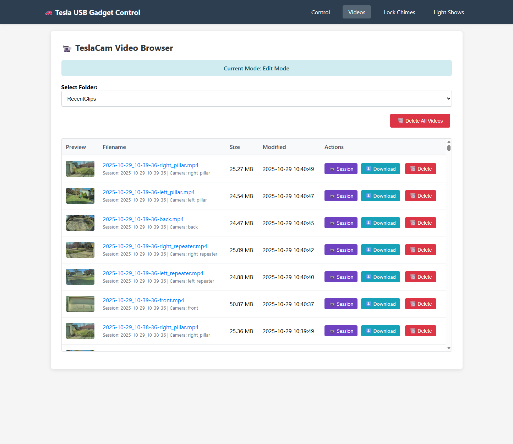

# Tesla USB Gadget Setup

A comprehensive Raspberry Pi setup script that creates a USB mass storage gadget with dual partitions for Tesla dashcam and sentry mode recording.

## Overview

This script (`setup_usb.sh`) transforms your Raspberry Pi into a dual-LUN USB gadget that appears as **two separate USB drives** when connected to a Tesla vehicle:

- **LUN 0 (TeslaCam)**: Large partition for dashcam and sentry mode recordings (read-write)
- **LUN 1 (Lightshow)**: Smaller partition dedicated to lock chimes and light show files (read-only optimized for 15-30% performance improvement)

The system provides both manual control scripts and a web interface for managing the USB gadget functionality, with intelligent mode switching between Present (USB gadget active) and Edit (network access enabled) modes.

## Why?

I created this solution to allow me to have remote access to my Tesla dashcam footage without needing to physically remove the USB drive from the car. By using a Raspberry Pi Zero 2 W as a USB gadget, I can connect it to the Tesla and have it appear as a standard USB drive while also being able to access the files over the network when needed. This setup provides flexibility to switch between modes easily, manage files remotely, and even browse videos through a web interface. It enhances convenience and usability for Tesla owners who want to efficiently handle their dashcam recordings, update lock sounds, or add custom lightshow files without hassle.

## Features

- **Dual-LUN USB Gadget**: Creates two independent disk images with optimized configurations
  - **TeslaCam LUN**: Large exFAT partition (400GB+) for dashcam recordings with read-write access
  - **Lightshow LUN**: Smaller FAT32 partition (20GB) for lock chimes and light shows with read-only optimization
  - Each LUN appears as a separate USB drive to Tesla, preventing filesystem contention
  - Read-only mode on Lightshow partition provides 15-30% performance improvement
- **Samba Network Sharing**: Access files remotely via network shares with authentication
- **Web Control Interface**: Browser-based control panel for switching between modes with visual loading feedback
- **TeslaCam Video Browser**: Built-in web interface for browsing and playing dashcam videos
  - **Video thumbnails** with automatic background generation
  - **Delete functionality** for individual or bulk video removal (Edit mode only)
  - **Browser caching** for fast page loads
  - In-browser video playback and download
- **Lock Chimes Management**: Complete interface for managing Tesla lock chime sounds
  - Upload custom WAV files
  - Set any chime as the active LockChime.wav
  - Play/preview chimes with in-browser audio player
  - Delete unwanted chime files
  - Works in both Present (view/play only) and Edit (full management) modes
  - Loading indicators and MD5 verification ensure safe file operations
- **Light Shows Management**: Interface for managing custom Tesla light show files
  - Upload FSEQ and MP3 files
  - Grouped display (pairs FSEQ + MP3 files together)
  - Play/preview MP3 audio tracks in browser
  - Delete entire light show sets (removes both files)
  - Works in both Present (view/play only) and Edit (full management) modes
- **Live Mode Indicator**: Web UI shows whether the gadget is in USB or Edit mode
- **Safe Mode Switching**: Buttons disable during transitions to prevent multiple clicks
- **Auto-Boot Presentation**: Automatically presents the USB gadget when Pi boots
- **Manual Control Scripts**: Command-line scripts for switching between present/edit modes
- **Robust Error Handling**: Comprehensive error checking and cleanup for reliability
- **Dynamic User Support**: Works with any user account (detects SUDO_USER automatically)
- **Graceful Shutdown**: Background processes stop cleanly during mode switches to prevent corruption

## Requirements

- Raspberry Pi with USB OTG capability (Pi Zero, Pi 4, etc.)
- 128GB or larger microSD card for Pi OS, dashcam storage, and lightshow files
- Tested on Raspberry Pi "Trixie" OS Desktop (64-bit)
- Root/sudo access for installation
- Internet connection for package installation

## Quick Start

### 1. Prepare the Raspberry Pi

**Flash the OS:**
1. Download and install [Raspberry Pi Imager](https://www.raspberrypi.com/software/)
2. Insert your microSD card (128GB or larger recommended) into your computer
3. Launch Raspberry Pi Imager
4. Click "Choose Device" and select your Raspberry Pi model (e.g., Raspberry Pi Zero 2 W)
5. Click "Choose OS" → "Raspberry Pi OS (other)" → "Raspberry Pi OS (64-bit)" with Desktop (Debian "Trixie")
6. Click "Choose Storage" and select your microSD card
7. Click "Next" and when prompted, click "Edit Settings" to configure:
   - **General tab:**
     - Set hostname (e.g., `cybertruckusb`)
     - Enable SSH with password authentication
     - Set username and password (recommended username: `pi`)
     - Configure wireless LAN with your WiFi SSID and password
     - Set locale settings (timezone and keyboard layout)
   - **Services tab:**
     - Enable SSH (if not already enabled)
8. Click "Save" and then "Yes" to apply OS customization settings
9. Click "Yes" to confirm writing to the microSD card
10. Wait for the imaging process to complete

**Boot the Raspberry Pi:**
1. Remove the microSD card from your computer
2. Insert the microSD card into your Raspberry Pi
3. Connect power to the Raspberry Pi
4. Wait 2-3 minutes for the initial boot and configuration to complete
5. The Pi will automatically connect to your WiFi network

**Verify Connection:**
Test SSH access to your Pi:
```bash
# Use the hostname you configured (or find the IP address from your router)
ssh pi@cybertruckusb.local
# Or if hostname doesn't resolve:
ssh pi@<pi-ip-address>
```

### 2. Install TeslaUSB

Once connected via SSH, clone and run the setup script.  Do this in your home directory:

**Clone the repository:**
```bash
git clone https://github.com/mphacker/TeslaUSB.git
cd TeslaUSB
```

**Run the setup script:**
```bash
sudo ./setup_usb.sh
```

**The script will:**
- Install required packages (parted, dosfstools, python3-flask, samba)
- Configure USB gadget kernel module (dwc2, libcomposite)
- Create two separate disk images:
  - **usb_cam.img**: Large exFAT partition for TeslaCam recordings
  - **usb_lightshow.img**: Smaller FAT32 partition for lock chimes and light shows
- **Create Chimes folder**: Automatically creates `/Chimes` directory on LightShow partition
- **Migrate existing WAV files**: Moves any existing lock chimes (except active `LockChime.wav`) to Chimes library
- Configure dual-LUN USB gadget with optimized read-only settings
- Set up Samba shares for network access
- Create control scripts and web interface
- Configure systemd services for auto-start

### 3. Access the Web Interface

**Access the web interface:**
- Open `http://<pi-ip-address>:5000` in your browser
- Or use the hostname: `http://cybertruckusb.local:5000`
- Use the buttons to switch between "Present USB" and "Edit USB" modes
- Navigate to the "Videos" tab to browse and play TeslaCam footage
- Navigate to "Lock Chimes" to manage custom lock sounds
- Navigate to "Light Shows" to manage custom light show files

### 4. Connect to Tesla

1. Connect the Raspberry Pi to your Tesla's USB port using the appropriate cable:
   - **Raspberry Pi Zero 2 W**: Use the USB port labeled "USB" (not "PWR")
   - **Raspberry Pi 4/5**: Use the USB-C port
2. **The Tesla will detect TWO separate USB drives:**
   - **LUN 0 (TeslaCam)**: Large drive for dashcam and sentry recordings
   - **LUN 1 (LightShow)**: Smaller drive for lock chimes and light show files

### 5. Upgrading to Latest Version

**To upgrade your installation to the latest code from GitHub:**
```bash
# Navigate to the gadget directory and run upgrade script
cd /home/pi/TeslaUSB  # or your configured GADGET_DIR
./upgrade.sh
```

The upgrade script will:
- Pull the latest code from GitHub (handles file permission conflicts automatically)
- Prompt you to run setup to apply changes
- Optionally restore your previous mode (edit/present) after setup

### 6. Removal (Optional)

**To remove everything later:**
```bash
# Navigate to the gadget directory and run cleanup
cd /home/pi/TeslaUSB  # or your configured GADGET_DIR
sudo ./cleanup.sh
```

## Configuration

Edit the configuration section at the top of `setup_usb.sh`:

```bash
# ================= Configuration =================
GADGET_DIR_DEFAULT="/home/pi/TeslaUSB"     # Installation directory
IMG_CAM="usb_cam.img"                      # TeslaCam image filename
IMG_LIGHTSHOW="usb_lightshow.img"          # Lightshow image filename
CAM_SIZE="400G"                            # TeslaCam partition size (large)
LIGHTSHOW_SIZE="20G"                       # Lightshow partition size (smaller)
LABEL_CAM="TeslaCam"                       # TeslaCam partition label
LABEL_LIGHTSHOW="LightShow"                # Lightshow partition label
MNT_DIR="/mnt/gadget"                      # Mount point directory
CONFIG_FILE="/boot/firmware/config.txt"    # Pi config file location
WEB_PORT=5000                              # Web interface port
SAMBA_PASS="tesla"                         # Samba password
```

**Architecture Notes:**
- **Dual-LUN design**: Two separate disk images (not partitions) for complete filesystem isolation
- **TeslaCam LUN (ro=0)**: Read-write access for Tesla to record dashcam footage continuously
- **Lightshow LUN (ro=1)**: Read-only access provides 15-30% performance improvement when Tesla loads light shows or plays lock chimes
- Both LUNs appear as independent USB drives to Tesla, preventing filesystem contention
- **Chimes folder**: Setup automatically creates `/Chimes` directory on LightShow partition and migrates existing WAV files

## Usage Modes

### Web Control Interface

The web interface provides an intuitive control panel for managing your Tesla USB gadget:


Use the control panel to switch between Present USB Mode (for Tesla connection) and Edit USB Mode (for file management). The interface shows your current mode and provides access to all features through the navigation tabs.

### Present USB Mode
When in this mode:
- Pi appears as **two USB drives** to Tesla (dual-LUN configuration)
  - **LUN 0 (TeslaCam)**: Read-write for dashcam recordings
  - **LUN 1 (LightShow)**: Read-only optimized for 15-30% performance improvement
- Samba shares are stopped
- Partitions are mounted locally in **read-only** mode for browsing
  - `/mnt/gadget/part1-ro` - Read-only access to TeslaCam partition
  - `/mnt/gadget/part2-ro` - Read-only access to LightShow partition
- Tesla can record dashcam/sentry footage to LUN 0
- Tesla can load light shows and play lock chimes from LUN 1 with optimized performance
- You can browse/view files locally or via the web interface (e.g., watch videos, play audio)
- Web interface: View and play videos, lock chimes, and light shows (no editing)

**Safety Note**: The read-only mounts allow you to access files while the gadget is active. This is generally safe for read-only access, but be aware that if the Tesla is actively writing to LUN 0 (TeslaCam), you may see stale cached data. Best practice is to browse files when the Tesla is not actively recording (e.g., after driving).

**Activate via:**
- Web interface: Click "Present USB Gadget"
- Command line: `sudo /home/pi/TeslaUSB/present_usb.sh`
- Auto-activated on boot by default

### Edit USB Mode  
When in this mode:
- USB gadget is disconnected
- Read-only mounts are unmounted
- Partitions are mounted locally on Pi in **read-write** mode
  - `/mnt/gadget/part1` - Read-write access to partition 1 (TeslaCam)
  - `/mnt/gadget/part2` - Read-write access to partition 2 (LightShow, Lock Chimes)
- Samba shares are active for network access
- You can manage files via network, web interface, or direct Pi access
- Web interface: Full functionality including upload, delete, and file management

**Activate via:**
- Web interface: Click "Edit USB (mount + Samba)"
- Command line: `sudo /home/pi/TeslaUSB/edit_usb.sh`

## Network Access

When in Edit USB mode, access files via Samba shares:

- **Share 1**: `\\<pi-ip-address>\gadget_part1`
- **Share 2**: `\\<pi-ip-address>\gadget_part2`
- **Username**: Your Pi username (or SUDO_USER if run with sudo)
- **Password**: Value set in `SAMBA_PASS` (default: "tesla")

## Local File Access

### Web-Based Video Browser
The web interface includes a built-in TeslaCam video browser accessible in both Present and Edit modes:



**Features:**
- Browse all TeslaCam folders (RecentClips, SavedClips, SentryClips, etc.)
- **Video thumbnails** with automatic background generation for quick preview
- View videos with sortable table showing filename, size, and date
- Play videos directly in the browser using the built-in player
- Download individual videos to your computer
- **Delete videos** individually or in bulk (Edit mode only)
- Clean, responsive interface with scrollable table for many videos
- **Browser caching** for fast page loads with many videos
- Works in both Present (read-only) and Edit modes

**Multi-Camera Session View:**


Click the "Session" button next to any video to view all six camera angles synchronized together. The multi-camera view includes:
- All 6 Tesla camera angles (Front, Back, Left Pillar, Right Pillar, Left Repeater, Right Repeater)
- Synchronized playback controls (Play All, Pause All, Restart, Sync Playback)
- **Auto-Sync toggle**: Keeps all cameras synchronized automatically during playback (enabled by default)
- **Low Bandwidth mode**: Optimized for Pi Zero 2 W - streams videos on-demand instead of preloading
- Individual video controls for each camera
- Real-time status indicators showing buffer/streaming state
- Session information showing timestamp and camera count

**Performance Optimization:**
- **HTTP Range Requests**: Videos stream efficiently using HTTP byte-range requests
- **Low Bandwidth Mode** (recommended for Pi Zero 2 W):
  - Click "Low Bandwidth: OFF" to enable
  - Disables preloading - videos stream only when playing
  - Significantly reduces memory and bandwidth usage
  - Allows smooth playback on resource-constrained devices
- **Normal Mode**: Buffers video metadata for slightly better seek performance
- **Auto-Sync**: Automatically corrects drift between cameras every 500ms (0.2s threshold)

**Access:**
- Navigate to `http://<pi-ip-address>:5000/videos` in your web browser
- Or click the "Videos" tab in the web interface navigation

**Usage:**
1. Select a folder from the dropdown (e.g., RecentClips)
2. Thumbnails load automatically with lazy loading for smooth scrolling
3. Click any video filename to play it in the browser
4. Click the Download button to save a video to your computer
5. **In Edit mode**: Use Delete buttons to remove individual videos or click "Delete All Videos" for bulk deletion
6. Videos are sorted by date (newest first) and the table scrolls for easy navigation

**Thumbnail Generation:**
- Thumbnails are automatically generated in the background
- Generated thumbnails are cached persistently (survive reboots)
- Background process runs every 15 minutes with low priority (Nice=19)
- Memory-constrained to prevent system overload (100MB limit)
- Only generates thumbnails for new videos (skips existing)
- Graceful shutdown when switching modes to prevent file system corruption

### Lock Chimes Management
The web interface includes a complete lock chimes management system with organized library storage:


**Features:**
- **Organized Chimes Library**: All custom lock chimes stored in dedicated `/Chimes` folder on LightShow partition
- **Active Chime Display**: Shows currently active `LockChime.wav` with preview player
- **Library Browser**: View all available chimes with validation status indicators
- **WAV Format Validation**: Automatic checking for Tesla compatibility:
  - 16-bit PCM format required
  - 44.1 kHz or 48 kHz sample rate
  - Uncompressed audio (no compression)
  - File size under 1 MB
  - Invalid files clearly marked with error messages
- **Play/Preview**: Built-in audio player for all chimes (active and library)
- **Download**: Download any chime from the library to your computer
- **Upload**: Add custom WAV files to the Chimes library (Edit mode only)
- **Set as Active**: Copy any valid chime from library to root as `LockChime.wav` (Edit mode only)
- **Delete**: Remove unwanted chimes from library (Edit mode only, cannot delete active chime)
- **Visual Feedback**: Loading indicators during file operations
- **Cache-Busting**: Multiple sync operations and timestamp updates ensure Tesla recognizes new chimes
- Works in both Present (view/play/download only) and Edit (full management) modes

**Architecture:**
- **Chimes Library**: `/Chimes/` folder on LightShow partition stores all your custom lock chimes
- **Active Chime**: `LockChime.wav` in partition root - this is what Tesla actually plays
- **Migration**: Setup automatically migrates existing WAV files to Chimes folder on first run
- **Workflow**: Upload → Validate → Store in library → Set as active → Copy to root → Cache bust

**Access:**
- Navigate to `http://<pi-ip-address>:5000/lock_chimes` in your web browser
- Or click the "Lock Chimes" tab in the web interface navigation

**Usage:**
1. In Edit mode, upload your custom WAV files using the upload form
   - Files are automatically validated for Tesla compatibility
   - Valid files are stored in the Chimes library
   - Invalid files are rejected with specific error messages
2. Preview any chime by clicking the audio player (works in both modes)
3. Download any chime to your computer with the Download button (works in both modes)
4. Click "Set as Active" to make a library chime the active lock sound
   - Copies the file from `/Chimes/` to root as `LockChime.wav`
   - Uses cache-busting techniques to ensure Tesla recognizes the change
   - Loading overlay shows progress during the operation
5. The active chime section shows what's currently set with its own player
6. Delete unwanted files from the library with the Delete button (Edit mode only)
7. In Present mode, you can view, play, and download all chimes but cannot modify them

### Light Shows Management
The web interface includes a complete light shows management system:


**Features:**
- View all FSEQ and MP3 files in the partition 2 LightShow directory
- **Grouped display** - FSEQ and MP3 files with matching names appear together
- **Play/preview** MP3 audio tracks directly in browser
- **Upload** custom FSEQ or MP3 files (Edit mode only)
- **Delete** entire light show sets with one button (removes both FSEQ and MP3) (Edit mode only)
- Shows file sizes for both FSEQ and MP3 files
- Visual loading indicator during operations
- Works in both Present (view/play only) and Edit (full management) modes

**Access:**
- Navigate to `http://<pi-ip-address>:5000/light_shows` in your web browser
- Or click the "Light Shows" tab in the web interface navigation

**Usage:**
1. In Edit mode, upload FSEQ or MP3 files using the upload form
2. Files with matching names (e.g., "show.fseq" and "show.mp3") are grouped together
3. Preview audio by clicking the audio player for any MP3 file
4. Delete entire light shows (both files) with the Delete button
5. In Present mode, you can view and play audio but cannot modify files

**File Grouping:**
- Light shows typically consist of two files: an FSEQ file (sequence data) and an MP3 file (audio)
- The interface automatically groups files by base name (e.g., "MyShow.fseq" + "MyShow.mp3")
- Deleting removes both files in the group
- You can upload FSEQ and MP3 separately - they'll be grouped if names match

### Web Interface Navigation
Click the "Tesla USB Gadget Control" header text on any page to return to the home page.

### Present USB Mode (Read-Only)
When in Present USB mode, you can access files locally on the Pi:

- **Partition 1**: `/mnt/gadget/part1-ro` (read-only)
- **Partition 2**: `/mnt/gadget/part2-ro` (read-only)

**Use cases:**
- Browse dashcam footage without switching modes
- Copy files from the Pi to another location
- Play videos directly using VLC or other media players
- Check storage usage: `df -h /mnt/gadget/part1-ro`

**Example:**
```bash
# List recent dashcam videos
ls -lht /mnt/gadget/part1-ro/TeslaCam/RecentClips/ | head -10

# Copy a specific video to your home directory
cp /mnt/gadget/part1-ro/TeslaCam/RecentClips/2025-10-29_12-30-15-front.mp4 ~/

# Watch a video directly
vlc /mnt/gadget/part1-ro/TeslaCam/RecentClips/2025-10-29_12-30-15-front.mp4
```

### Edit USB Mode (Read-Write)
When in Edit USB mode, access files locally with full read-write permissions:

- **Partition 1**: `/mnt/gadget/part1` (read-write)
- **Partition 2**: `/mnt/gadget/part2` (read-write)

**Use cases:**
- Delete old footage to free up space
- Organize files into folders
- Add custom lightshow files
- Full filesystem management

## Project Structure

```
TeslaUSB/
├── setup_usb.sh              # Main setup script
├── cleanup.sh                # Cleanup script
├── upgrade.sh                # Upgrade script (pulls latest from GitHub)
├── scripts/                  # Source script templates
│   ├── present_usb.sh           # USB gadget presentation script
│   ├── edit_usb.sh              # Edit mode script  
│   ├── web_control.py           # Flask web interface
│   └── generate_thumbnails.py   # Background thumbnail generator
├── templates/                # Systemd service templates
│   ├── gadget_web.service       # Web interface service
│   ├── present_usb_on_boot.service # Auto-present service
│   ├── thumbnail_generator.service # Thumbnail generation service
│   └── thumbnail_generator.timer   # Thumbnail generation timer
├── README.md                 # This documentation
└── README_scripts.md         # Script template documentation
```

## Generated Files

The setup script copies and configures template files to the gadget directory:

| File | Source Template | Purpose |
|------|-----------------|---------|
| `usb_cam.img` | *Generated* | TeslaCam disk image (large, exFAT) |
| `usb_lightshow.img` | *Generated* | LightShow disk image (smaller, FAT32) |
| `present_usb.sh` | `scripts/present_usb.sh` | Script to activate USB gadget mode |
| `edit_usb.sh` | `scripts/edit_usb.sh` | Script to activate edit/mount mode |
| `web_control.py` | `scripts/web_control.py` | Flask web interface application |
| `generate_thumbnails.py` | `scripts/generate_thumbnails.py` | Background thumbnail generation script |
| `thumbnails/` | *Generated directory* | Persistent cache for video thumbnails |
| `state.txt` | *Generated* | Stores the last-known USB gadget mode |
| `cleanup.sh` | *Repository file* | Script to safely remove all setup artifacts |
| `upgrade.sh` | *Repository file* | Script to pull latest code and update installation |

**Note**: Scripts are maintained as template files in the repository, making them easier to update and version control. See `README_scripts.md` for details.

## Customizing Scripts

To modify script behavior:

1. **Edit source files**: Modify files in `scripts/` or `templates/` directories
2. **Update installation**: Use the upgrade script or re-run setup
   ```bash
   # Option 1: Use upgrade script (pulls latest from GitHub)
   ./upgrade.sh
   
   # Option 2: Re-run setup manually (applies local changes)
   sudo ./setup_usb.sh
   ```
3. **For testing**: Edit generated files directly in the gadget directory (changes will be overwritten on next setup)

**Example**: To add custom logging to the present script:
```bash
# Edit the source template
nano scripts/present_usb.sh

# Apply changes using upgrade script
./upgrade.sh
```

## Systemd Services

Four services/timers are installed:

| Service/Timer | Purpose | Status |
|---------|---------|---------|
| `gadget_web.service` | Runs web interface on boot | Enabled |
| `present_usb_on_boot.service` | Auto-presents USB on boot | Enabled |
| `thumbnail_generator.service` | Generates video thumbnails | On-demand |
| `thumbnail_generator.timer` | Schedules thumbnail generation (every 15 min) | Enabled |

**Service management:**
```bash
# Check web interface status
sudo systemctl status gadget_web.service

# Check thumbnail generator status
sudo systemctl status thumbnail_generator.service
sudo systemctl status thumbnail_generator.timer

# Disable auto-present on boot
sudo systemctl disable present_usb_on_boot.service

# Disable automatic thumbnail generation
sudo systemctl disable thumbnail_generator.timer

# Restart web interface
sudo systemctl restart gadget_web.service

# Manually trigger thumbnail generation
sudo systemctl start thumbnail_generator.service
```

## Cleanup and Removal

### Automatic Cleanup Script

The repository includes a comprehensive cleanup script (`cleanup.sh`) that safely removes all files and configurations created by the setup script.

**Usage:**
```bash
# Navigate to the gadget directory
cd /home/pi/TeslaUSB  # or your configured GADGET_DIR

# Run the cleanup script (requires sudo)
sudo ./cleanup.sh
```

**What the cleanup script removes:**
- **Systemd Services**: Stops and removes `gadget_web.service`, `present_usb_on_boot.service`, `thumbnail_generator.service`, and `thumbnail_generator.timer`
- **USB Gadget Module**: Safely removes `g_mass_storage` kernel module
- **Loop Devices**: Detaches any loop devices associated with the disk image
- **Mount Points**: Unmounts all partitions (read-only and read-write) and removes mount directories (`/mnt/gadget`)
- **Samba Configuration**: Removes gadget share sections from `/etc/samba/smb.conf`
- **Generated Files**: Removes all scripts, web interface, disk image, and thumbnail cache
- **System Configuration**: Reloads systemd and restarts Samba

**Safety Features:**
- **Confirmation Prompt**: Asks for confirmation before proceeding
- **Resource Cleanup**: Ensures proper cleanup of system resources before file removal
- **Error Resilience**: Continues cleanup even if individual steps fail
- **Backup Creation**: Creates backup of Samba configuration before modification
- **Root Requirement**: Ensures proper permissions for system-level cleanup

**Example Output:**
```bash
Tesla USB Gadget Cleanup Script
===============================
Gadget directory: /home/pi/TeslaUSB
Image file: /home/pi/TeslaUSB/usb_dual.img

This will remove all USB gadget configuration and files.
The following will be cleaned up:
  - Systemd services (gadget_web, present_usb_on_boot, thumbnail_generator)
  - USB gadget module and loop devices
  - Samba share configuration
  - Mount directories (/mnt/gadget)
  - Thumbnail cache directory
  - All files in /home/pi/TeslaUSB (except this script)
  - Disk image: /home/pi/TeslaUSB/usb_dual.img

Are you sure you want to proceed? (y/N): y

Starting cleanup process...
[... detailed cleanup steps ...]
Cleanup completed successfully!
```

**Note**: The cleanup script preserves itself, so you can run it multiple times if needed. You may delete it manually after cleanup is complete.

### Manual Package Removal

After running the cleanup script, you can optionally remove the packages that were installed:

```bash
# Remove installed packages (optional)
sudo apt remove --autoremove python3-flask samba samba-common-bin

# Note: parted, dosfstools, and util-linux are usually system packages
# and should not be removed unless you're certain they're not needed
```

## Troubleshooting

### Common Issues


**Partition nodes not appearing:**
- The script waits up to 10 seconds for partition nodes to appear
- On slower systems, this may indicate hardware or kernel issues

**Web interface not accessible:**
- Check that port 5000 is open: `sudo netstat -tulpn | grep 5000`
- Verify service is running: `sudo systemctl status gadget_web.service`
- View logs for errors: `sudo journalctl -u gadget_web.service -f`

**Video browser not showing videos:**
- Ensure you're in Present or Edit mode (not Unknown mode)
- Verify TeslaCam folder exists on partition 1
- Check that the partition is properly mounted (read-only in Present mode, read-write in Edit mode)
- Videos must have .mp4, .avi, .mov, or .mkv extensions

**Thumbnails not generating:**
- Check thumbnail generator service: `sudo systemctl status thumbnail_generator.service`
- Check timer status: `sudo systemctl status thumbnail_generator.timer`
- View generation logs: `sudo journalctl -u thumbnail_generator.service -f`
- Manually trigger generation: `sudo systemctl start thumbnail_generator.service`
- Ensure ffmpeg is installed: `which ffmpeg`
- Thumbnails are stored in `~/TeslaUSB/thumbnails/` and persist across reboots

**Mode switching fails or causes corruption:**
- Ensure thumbnail generator stops cleanly during mode switches
- Check for processes accessing mounted partitions: `sudo lsof | grep /mnt/gadget`
- The scripts now automatically stop the thumbnail generator before switching modes
- If corruption occurs, run `chkdsk` on Windows or `fsck` on Linux to repair the filesystem

**Samba shares appear empty or don't show files:**
- This can happen if switching from Present to Edit mode while Windows has cached the empty share structure
- **Solution 1**: Disconnect cached connections on Windows:
  ```powershell
  net use \\<pi-hostname>\gadget_part1 /delete /y
  net use \\<pi-hostname>\gadget_part2 /delete /y
  ```
- **Solution 2**: On the Pi, force Samba to refresh:
  ```bash
  sudo smbcontrol all close-share gadget_part1
  sudo smbcontrol all close-share gadget_part2
  sudo systemctl restart smbd nmbd
  ```
- **Prevention**: The edit_usb.sh script automatically refreshes Samba, but stale read-only mounts can prevent proper mounting. Always ensure clean mode switching.

**Samba access denied:**
- Verify username and password match the configuration
- Check that user exists in Samba: `sudo pdbedit -L`

**Read-only mounts showing stale data:**
- This can happen if Tesla is actively writing while you're browsing
- Solution: Wait until Tesla is off/disconnected before browsing files
- Or switch to Edit mode for guaranteed consistent view

**Cannot unmount /mnt/gadget/part1-ro or part2-ro:**
- Check if any programs are accessing the mount: `sudo lsof | grep /mnt/gadget`
- Close any open file browsers, media players, or terminal sessions in those directories
- The scripts will forcefully unmount if needed, but clean unmounts are preferred

**iOS file upload not working (Lock Chimes, Light Shows):**
- **Issue**: File upload ("Choose File" button) may not work on iOS with Microsoft Edge or other third-party browsers
- **Root Cause**: Apple requires all iOS browsers to use WebKit (Safari's engine), but third-party browsers like Edge have additional iOS sandbox restrictions that prevent file system access
- **Solution**: Use **Safari** on iOS for file uploads - it has native permissions that third-party browsers don't have
- **Workaround**: Use a desktop browser (any browser works fine on Windows, macOS, Linux) or Safari on iOS
- **Technical Details**: 
  - All iOS browsers must use WebKit per Apple's App Store requirements
  - Safari is Apple's native browser with full file system permissions
  - Third-party browsers (Edge, Chrome, Firefox) on iOS are sandboxed and may have limited file access
  - Desktop browsers (Windows/Mac/Linux) work normally regardless of browser choice

**Tesla not recognizing new lock chime (LockChime.wav):**
Tesla aggressively caches the LockChime.wav file and may not detect changes immediately. The web interface uses several cache-busting techniques automatically when you set a new chime:
- **Automatic**: The "Set as Active" function:
  1. Validates the chime format (16-bit PCM, 44.1/48 kHz, <1MB)
  2. Deletes the old `LockChime.wav` from root
  3. Syncs filesystem to disk (twice for safety)
  4. Copies validated chime from `/Chimes/` library to root
  5. Updates file timestamps
  6. Drops Linux filesystem caches
  7. Refreshes Samba shares for network visibility
- **If Tesla still plays old chime**: Try these manual steps:
  1. **Power cycle the Tesla**: Put the car to sleep (close doors, walk away for 5+ minutes), then wake it up
  2. **Switch USB modes**: Go to Edit mode, wait 10 seconds, then back to Present mode. This forces Tesla to re-enumerate the USB device
  3. **Physical reconnect**: Unplug the Pi from Tesla's USB port, wait 10 seconds, plug back in
  4. **Tesla reboot**: As a last resort, do a full Tesla reboot (hold both scroll wheels until screen goes black)
- **Best practice**: Change lock chimes when the car is parked and in sleep mode, not while actively driving or using the infotainment system
- **Note**: The organized `/Chimes/` library allows you to keep multiple chimes ready and switch between them easily without re-uploading

### Log Files

Check systemd logs for issues:
```bash
# Web interface logs
sudo journalctl -u gadget_web.service -f

# Auto-present service logs  
sudo journalctl -u present_usb_on_boot.service

# General system logs
sudo dmesg | grep -i "mass_storage\|gadget"
```

### Manual Cleanup

**For automatic cleanup, use the provided cleanup script instead:**
```bash
cd /home/pi/TeslaUSB  # or your GADGET_DIR
sudo ./cleanup.sh
```

**If you need to manually clean up (emergency situations only):**
```bash
# Remove USB gadget module
sudo rmmod g_mass_storage

# Unmount all partitions (edit and read-only modes)
sudo umount /mnt/gadget/part1 /mnt/gadget/part2 /mnt/gadget/part1-ro /mnt/gadget/part2-ro

# Detach loop devices
sudo losetup -D

# Stop services
sudo systemctl stop gadget_web.service present_usb_on_boot.service
```

## Security Considerations

- **Samba Password**: The default password "tesla" should be changed for production use
- **Web Interface**: Runs on all interfaces (0.0.0.0) - consider firewall rules
- **File Permissions**: Uses umask 002 for group write access

## Technical Details

### Disk Image Structure
- **Total Size**: PART1_SIZE + PART2_SIZE + 2MB (for partition table)
- **Partition Table**: MBR/MSDOS style
- **File System**: FAT32 or exFAT for partitions based on size specified
- **Sparse File**: Only uses space as needed

### USB Gadget Implementation
- Uses Linux `g_mass_storage` kernel module
- Configured as removable storage (removable=1)
- Write access enabled (ro=0)
- No command stalling (stall=0)

### Error Handling Features
- Comprehensive error checking for all operations
- Automatic cleanup of loop devices on failure
- Trap handlers for graceful script interruption
- Partition detection polling (avoids race conditions)

