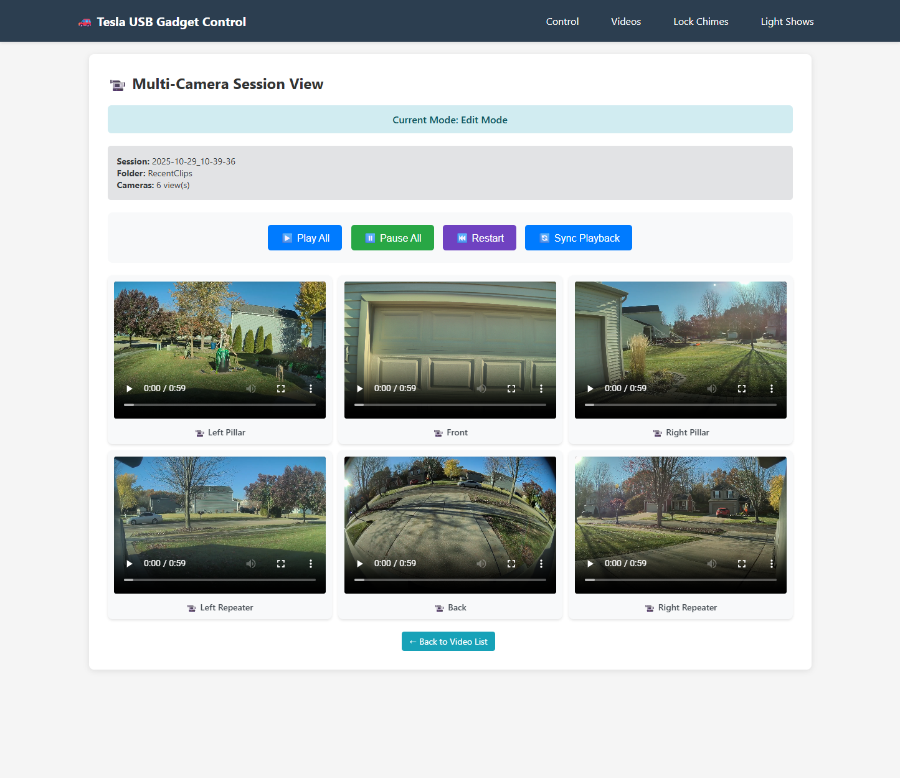
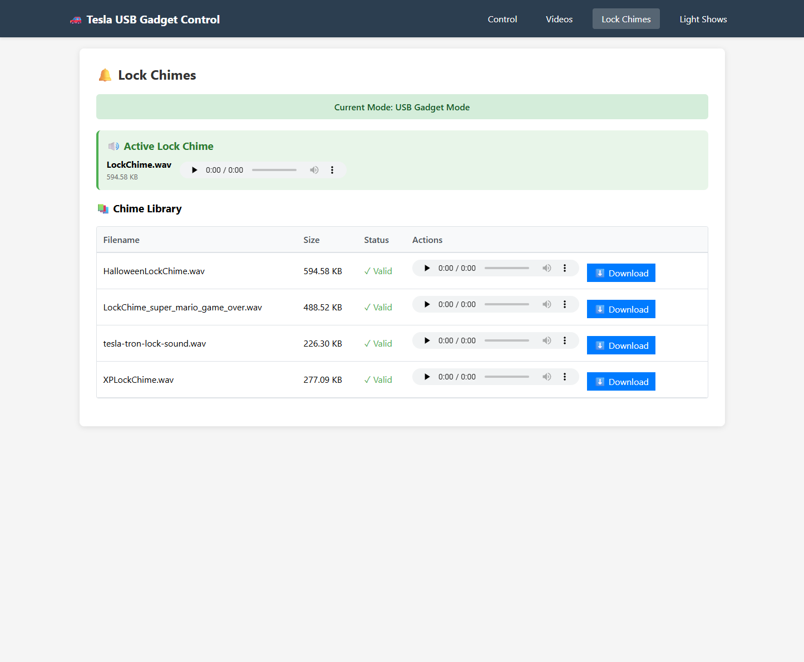

# TeslaUSB

Transform your Raspberry Pi into a smart USB drive for Tesla dashcam recordings with remote access, web-based file management, and automated maintenance.

## Overview

TeslaUSB creates a dual-drive USB gadget that appears as **two separate USB drives** to your Tesla:

- **TeslaCam Drive**: Large exFAT partition (400GB+) for dashcam and sentry recordings
- **LightShow Drive**: Smaller FAT32 partition (20GB) for lock chimes and light shows with read-only optimization

**Key Benefits:**
- Remote access to dashcam footage without physically removing storage
- Web interface for browsing videos, managing chimes/light shows, and monitoring storage (with light/dark mode)
- Automatic cleanup policies to manage disk space
- Scheduled chime changes for holidays, events, or automatic rotation
- Offline access point for in-car web access when WiFi is unavailable

> **⚠️ Personal Project Notice**
>
> This is a personal project built for my own use. You are welcome to fork the code and make your own changes or updates. Please be aware:
> - The Git repository may update frequently with new features and changes
> - Bugs may be introduced into the main branch without extensive testing
> - Bug fixes will be worked on as time permits, but **no timelines or guarantees** are provided
> - You have access to the source code - if something breaks, you can attempt to fix it yourself
> - This project is provided as-is with no warranty or support obligations

## Features

### Core Functionality
- **Dual-Drive USB Gadget**: Two independent filesystems (TeslaCam + LightShow) with optimized performance
- **Two Operating Modes**:
  - **Present Mode**: Active USB gadget for Tesla recording
  - **Edit Mode**: Network access via Samba shares for file management
- **Web Interface**: Browser-based control panel accessible at `http://<pi-ip>:5000`

### Video Management
- Browse all TeslaCam folders (RecentClips, SavedClips, SentryClips)
- Auto-generated video thumbnails
- In-browser playback with multi-camera session view (6 cameras synchronized)
- Download or delete videos individually or in bulk
- Storage analytics with folder-by-folder breakdown

### Lock Chime Management
- Upload WAV or MP3 files (automatically converted to Tesla-compatible format)
- Organized chime library with preview and download
- Volume normalization presets (Broadcast, Streaming, Loud, Maximum)
- **Chime Groups**: Organize chimes by theme (Holidays, Funny, Seasonal, etc.)
- **Random Selection on Boot**: Automatically pick a different chime from your selected group each time the device boots
- Scheduled chime changes:
  - Weekly schedules (specific days/times)
  - Date-based schedules
  - Holiday schedules (Christmas, Easter, Thanksgiving, etc.)
  - Recurring rotation (every 15min to 12 hours, or on boot)

### Light Show Management
- Upload FSEQ and MP3/WAV files
- Grouped display (pairs sequence + audio files)
- Preview MP3/WAV tracks in browser
- Delete complete light show sets

### Automatic Maintenance
- **Storage Cleanup**: Age, size, or count-based policies per folder
- **Boot Cleanup**: Optional automatic cleanup before presenting to Tesla
- **On-Demand Thumbnails**: Instant generation via PyAV as you browse (cached for 7 days)
- **Chime Scheduler**: Checks every 60 seconds for scheduled changes
- **Hardware Watchdog**: Automatic system recovery on hangs or crashes

### Network Features
- **Samba Shares**: Windows/Mac/Linux file access in Edit mode
- **Offline Access Point**: Automatic fallback AP when WiFi unavailable (in-car web access)

## Requirements

- **Tesla Software**: Version **2025.44.25.1 or later** (2025 Holiday Update) required for event thumbnails, SEI telemetry data, and multi-camera event structure
- Raspberry Pi with USB OTG capability (Pi Zero 2 W recommended, Pi 4, Pi 5)
- 128GB+ microSD card (for OS, dashcam storage, and light shows)
- Raspberry Pi OS (64-bit) Desktop - Debian "Trixie"
- Internet connection for initial setup

**Note for Pi Zero 2 W users**: Setup automatically optimizes memory by disabling unnecessary desktop services and enabling 1GB swap. This ensures stable operation on the 512MB RAM platform.

## Installation

### 1. Prepare Raspberry Pi

1. Flash **Raspberry Pi OS (64-bit) Desktop** using [Raspberry Pi Imager](https://www.raspberrypi.com/software/)
2. Configure OS customization settings:
   - Set hostname (e.g., `cybertruckusb`)
   - Enable SSH with password authentication
   - Set username/password (default: `pi`)
   - Configure WiFi credentials
   - Set timezone and keyboard layout
3. Insert microSD into Pi and boot (wait 2-3 minutes)
4. Verify SSH access: `ssh pi@cybertruckusb.local`

### 2. Install TeslaUSB

```bash
git clone https://github.com/mphacker/TeslaUSB.git
cd TeslaUSB
sudo ./setup_usb.sh
```

The setup script will:
- Install required packages (parted, dosfstools, python3-flask, python3-av, samba, hostapd, dnsmasq, ffmpeg)
- Optimize memory for low-RAM systems (disable desktop services, enable swap)
- Configure USB gadget kernel modules and hardware watchdog
- Create dual disk images (427GB TeslaCam + 20GB LightShow)
- Set up Samba shares and web interface with on-demand thumbnail generation
- Configure systemd services with auto-restart on failure
- Create `/Chimes` library and migrate existing lock chimes

### 3. Access Web Interface

Open `http://<pi-ip-address>:5000` or `http://<hostname>.local:5000` in your browser.

### 4. Connect to Tesla

Connect the Pi to your Tesla's USB port:
- **Pi Zero 2 W**: Use USB port labeled "USB" (not "PWR")
- **Pi 4/5**: Use USB-C port

Tesla will detect two separate USB drives automatically.

## Usage

### Operating Modes

**Present USB Mode** (default on boot):
- Pi appears as USB drives to Tesla
- Partitions mounted read-only locally at `/mnt/gadget/part1-ro`, `/mnt/gadget/part2-ro`
- Web interface: View/play only (no editing)
- Samba shares disabled

**Edit USB Mode**:
- USB gadget disconnected
- Partitions mounted read-write at `/mnt/gadget/part1`, `/mnt/gadget/part2`
- Web interface: Full file management (upload, delete, organize)
- Samba shares active for network access

**Switch modes** via web interface or command line:
```bash
sudo /home/pi/TeslaUSB/present_usb.sh  # Activate Present mode
sudo /home/pi/TeslaUSB/edit_usb.sh     # Activate Edit mode
```

### Network Access

**Samba Shares** (Edit mode only):
- `\\<pi-ip-address>\gadget_part1` - TeslaCam partition
- `\\<pi-ip-address>\gadget_part2` - LightShow partition
- Default credentials: username = `pi`, password = `tesla`

**Offline Access Point**:
When WiFi is unavailable, the Pi automatically creates a fallback access point:
- SSID: `TeslaUSB` (configurable in `scripts/config.sh`)
- Password: `teslausb1234` (change this!)
- IP: `192.168.4.1`
- Access web interface: `http://192.168.4.1:5000`
- Control from web UI: Force start/stop AP or leave in auto mode
  - **Start AP Now**: Forces AP on, persists across reboots (AP always on)
  - **Stop AP**: Returns to auto mode, persists across reboots (AP only starts if WiFi fails)
- Change credentials in `scripts/config.sh` before first use
- **Note**: After clicking "Start AP Now" or "Stop AP" buttons, the status may not update immediately. Wait 10-20 seconds and refresh the page to see the current state.

### Web Features

**Settings Tab**:
- Switch between Present USB and Edit USB modes
- Configure offline access point (SSID, password, auto/manual mode)
- View network status and Samba share information

**Videos Tab**:
- Browse all TeslaCam folders with auto-generated thumbnails
- Play videos in browser or download to computer
- Multi-camera session view (6 synchronized cameras)
- Delete videos individually or in bulk (Edit mode only)
- Low bandwidth mode for Pi Zero 2 W

**Lock Chimes Tab**:
- Upload WAV/MP3 files (auto-converted to Tesla format)
- Preview all chimes with in-browser audio player
- Set any chime as active `LockChime.wav`
- Built-in audio editor with waveform visualization:
  - Trim audio with visual waveform display
  - Volume normalization presets (Broadcast, Streaming, Loud, Maximum)
  - Real-time duration and file size preview
  - Save as new file or replace existing
- Schedule automatic chime changes (weekly, date, holiday, recurring)

**Light Shows Tab**:
- Upload and manage FSEQ + MP3/WAV light show files
- Grouped display for matching files
- Preview MP3/WAV audio in browser
- Delete complete light show sets

**Analytics Tab**:
- Partition usage gauge and folder breakdown
- Video count and size statistics
- Configure cleanup policies (age, size, count-based)
- Preview and execute cleanup operations

## Configuration

### Basic Settings

Edit `setup_usb.sh` before running initial setup:

```bash
GADGET_DIR_DEFAULT="/home/pi/TeslaUSB"  # Installation directory
PART1_SIZE="427G"                        # TeslaCam partition size
PART2_SIZE="20G"                         # LightShow partition size
WEB_PORT=5000                            # Web interface port
SAMBA_PASS="tesla"                       # Samba password (change this!)
```

### Advanced Settings

Edit `scripts/config.sh` after installation for offline access point:

```bash
OFFLINE_AP_ENABLED="true"              # Enable/disable fallback AP
OFFLINE_AP_SSID="TeslaUSB"             # AP network name (change this!)
OFFLINE_AP_PASSPHRASE="teslausb1234"   # AP password (change this!)
OFFLINE_AP_IPV4_CIDR="192.168.4.1/24"  # AP IP address
OFFLINE_AP_DISCONNECT_GRACE="30"       # Seconds offline before AP starts
OFFLINE_AP_FORCE_MODE="auto"           # Persistent AP mode: auto, force_on, force_off
# Note: AP always runs concurrently with WiFi client on a virtual interface
```

Restart WiFi monitor after changes: `sudo systemctl restart wifi-monitor.service`

## Maintenance

### Upgrade to Latest Version

```bash
cd /home/pi/TeslaUSB
./upgrade.sh
```

Pulls latest code from GitHub and prompts to run setup. Disk images and configuration are preserved.

### Uninstall

```bash
cd /home/pi/TeslaUSB
sudo ./cleanup.sh
```

Removes all files, services, and system configuration.

## Systemd Services

| Service/Timer | Purpose |
|---------------|---------|
| `gadget_web.service` | Web interface (port 5000) |
| `present_usb_on_boot.service` | Auto-present USB on boot with optional cleanup |
| `chime_scheduler.timer` | Check scheduled chime changes every 60 seconds |
| `wifi-monitor.service` | Manage offline access point |
| `watchdog.service` | Hardware watchdog for system reliability |

**Common Commands:**
```bash
# Check service status
sudo systemctl status gadget_web.service

# View logs
sudo journalctl -u gadget_web.service -f

# Restart web interface
sudo systemctl restart gadget_web.service

# Disable auto-present on boot
sudo systemctl disable present_usb_on_boot.service
```

## Troubleshooting

### Common Issues

**Web interface not accessible:**
```bash
# Check service status and logs
sudo systemctl status gadget_web.service
sudo journalctl -u gadget_web.service -f
```

**Videos not showing:**
- Verify correct mode (Present or Edit, not Unknown)
- Check TeslaCam folder exists on partition 1
- Confirm partition is properly mounted

**Samba shares appear empty:**
```bash
# Force Samba refresh
sudo smbcontrol all close-share gadget_part1
sudo smbcontrol all close-share gadget_part2
sudo systemctl restart smbd nmbd
```

**Tesla not recognizing new lock chime:**
Try these steps in order:
1. Power cycle Tesla (close doors, walk away 5+ minutes, wake up)
2. Switch USB modes (Edit → wait 10s → Present)
3. Physical reconnect (unplug Pi, wait 10s, plug back in)
4. Tesla reboot (hold both scroll wheels until screen goes black)

**Operation in Progress banner stuck:**
```bash
# Check and remove stale lock file if older than 120 seconds
ls -lh /home/pi/TeslaUSB/.quick_edit_part2.lock
rm /home/pi/TeslaUSB/.quick_edit_part2.lock
```

**iOS file upload not working:**
- Use **Safari** on iOS (third-party browsers have restricted file access)
- Desktop browsers work normally regardless of choice

### Logs

```bash
# Web interface logs
sudo journalctl -u gadget_web.service -f

# Chime scheduler logs
sudo journalctl -u chime_scheduler.service -f

# System USB logs
sudo dmesg | grep -i "mass_storage\|gadget"
```

## Technical Details

**Dual-Drive Architecture:**
- Two separate disk images (`usb_cam.img` 427GB exFAT, `usb_lightshow.img` 20GB FAT32)
- Sparse files (only use space as needed)
- Presented as dual-LUN USB gadget to Tesla

**USB Gadget Implementation:**
- Linux `g_mass_storage` kernel module via `libcomposite`
- LUN 0: Read-write (ro=0) for TeslaCam recordings
- LUN 1: Read-only (ro=1) for LightShow/Chimes (15-30% performance boost)

**Concurrency Protection:**
- `.quick_edit_part2.lock` file prevents race conditions
- 10-second timeout, 120-second stale lock detection
- All services and scripts respect lock state

---

## Screenshots

All screenshots shown in dark mode.






